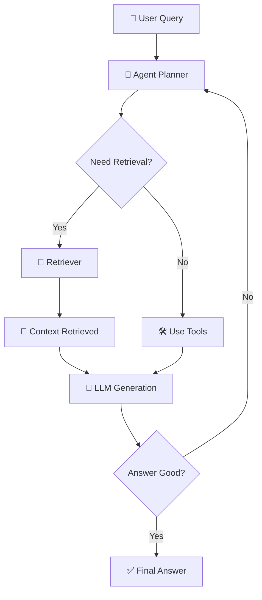
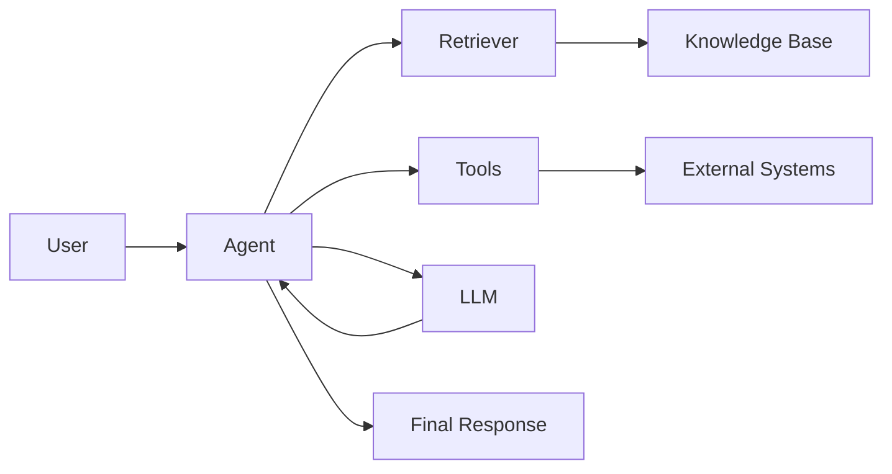

## 🤖 Agentic RAG (Retrieval-Augmented Generation with Agents)

Agentic RAG is an **advanced evolution of traditional RAG**, where instead of a single static retrieval + generation flow, you introduce **autonomous agents** that can *plan, decide, iterate, and use tools* to improve the quality of answers.

---

# 🧠 1. Concept in Detail

## 🔍 What is Traditional RAG?

Basic RAG works like this:

1. User asks a question
2. System retrieves relevant documents
3. LLM generates answer using retrieved context

👉 Limitation:

* One-shot retrieval
* No reasoning about *what to retrieve next*
* No correction or iteration

---

## 🚀 What is Agentic RAG?

Agentic RAG introduces an **AI agent layer** that:

* 🧭 Plans how to answer a query
* 🔄 Iteratively retrieves better context
* 🛠 Uses tools (search, DB, APIs)
* 🧠 Reflects and improves responses

👉 Think of it as:

> “RAG + Decision-making + Iteration + Tool usage”

---

## 🧩 Core Components

### 1. 🧠 Agent (The Brain)

* Decides *what to do next*
* Breaks query into steps
* Chooses tools

---

### 2. 🔎 Retriever (Memory Access)

* Vector DB / search engine
* Fetches relevant documents

---

### 3. 🛠 Tools

Examples:

* Web search 🌐
* SQL queries 🗄️
* APIs 🔗
* Code execution 💻

---

### 4. 📚 Knowledge Base

* Documents, embeddings, structured data

---

### 5. 🔁 Feedback Loop (Key Differentiator)

* Agent evaluates:

  * “Is this answer good?”
  * “Do I need more info?”

---

## 🔄 Agentic RAG Flow



---

## 🧠 Key Idea

👉 Traditional RAG = *Lookup + Answer*
👉 Agentic RAG = *Think → Act → Observe → Improve*

---

# ⚙️ 2. How to Implement

## 🏗️ High-Level Architecture



---

## 🧪 Step-by-Step Implementation

### Step 1: Choose LLM

* GPT / Claude / open-source model

---

### Step 2: Setup Knowledge Base

* Chunk documents
* Generate embeddings
* Store in vector DB (e.g., FAISS, Pinecone)

---

### Step 3: Build Retriever

* Semantic search
* Hybrid search (keyword + vector)

---

### Step 4: Add Agent Framework

Popular frameworks:

* LangChain Agents
* LlamaIndex Agents
* CrewAI

Agent capabilities:

* Tool calling
* Planning
* Memory

---

### Step 5: Define Tools

Examples:

```python
tools = [
  search_docs,
  query_database,
  call_api,
  calculator
]
```

---

### Step 6: Add Reasoning Loop

Pseudo-flow:

```python
while not done:
    thought = agent.plan()
    action = agent.choose_tool()
    observation = action.run()
    agent.reflect(observation)
```

---

### Step 7: Add Evaluation Layer

* Self-check (LLM critiques itself)
* Confidence scoring
* Retry if needed

---

# 🌍 3. Real-World Scenarios

## 📊 Scenario 1: Business Analytics Assistant

**User:** “Why did sales drop last quarter?”

Agent:

* 🧠 Breaks into sub-questions
* 🗄️ Queries DB
* 📊 Retrieves reports
* 🔁 Iterates until root cause found

---

## 🏥 Scenario 2: Medical Knowledge Assistant

**User:** “Best treatment for condition X?”

Agent:

* 📚 Retrieves research papers
* 🌐 Searches latest guidelines
* 🧠 Cross-validates sources
* ⚠️ Flags uncertainty

---

## 💻 Scenario 3: Developer Copilot

**User:** “Fix this performance issue”

Agent:

* 📂 Reads codebase
* 🛠 Runs profiling tools
* 🔎 Searches similar issues
* 🔁 Tests multiple fixes

---

## 🛍️ Scenario 4: E-commerce Assistant

**User:** “Best laptop under $1000 for gaming”

Agent:

* 🔎 Retrieves product data
* 🌐 Checks reviews
* ⚖️ Compares specs
* 🎯 Suggests optimized options

---

## 🧾 Scenario 5: Document QA (Legal/Finance)

**User:** “Summarize risks in this contract”

Agent:

* 📄 Parses document
* 🔎 Retrieves related clauses
* 🧠 Identifies risk patterns
* 🔁 Re-checks missing sections

---

# ⚡ 4. Advantages & Requirements

## ✅ Advantages

### 🧠 Smarter Reasoning

* Multi-step thinking
* Better than one-shot RAG

---

### 🔁 Iterative Improvement

* Self-correction
* Reduces hallucination

---

### 🛠 Tool Integration

* Can access real-time data
* Works beyond static knowledge

---

### 🎯 Higher Accuracy

* Context refinement
* Multi-source validation

---

### 🌐 Dynamic Decision Making

* Chooses best path per query

---

## ⚠️ Requirements

### 💻 Infrastructure

* Vector DB
* Tool integrations
* Compute for multiple iterations

---

### 🧠 Good Prompt Design

* Agent instructions
* Tool usage guidelines

---

### 📊 Observability

* Logging agent decisions
* Debugging reasoning steps

---

### ⚡ Performance Optimization

* Caching
* Limiting loops
* Cost control

---

### 🔐 Safety & Guardrails

* Prevent infinite loops
* Control tool access

---

# 🧠 Final Intuition

👉 Think of it like this:

| Approach    | Behavior                                         |
| ----------- | ------------------------------------------------ |
| RAG         | 📖 “Find and answer”                             |
| Agentic RAG | 🧠 “Think, search, decide, improve, then answer” |

---

# 🔮 When Should You Use Agentic RAG?

Use it when:

* Queries are **complex or multi-step**
* You need **tool usage**
* Accuracy is **critical**
* Data is **dynamic or distributed**

Avoid it when:

* Simple FAQ use cases
* Low latency is critical
* Cost must be minimal
