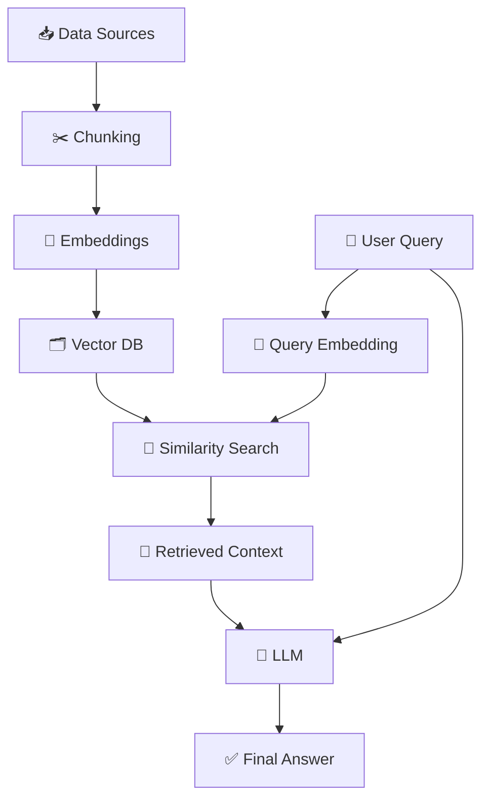
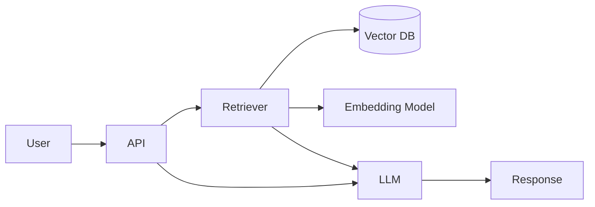

## 📚 RAG (Retrieval-Augmented Generation)

RAG is one of the most important architectures in modern AI systems. It combines **information retrieval 📖 + language generation 🤖** to produce accurate, grounded answers.

---

# 🧠 1. Concept in Detail

## 🔍 What is RAG?

👉 Simple definition:

> **RAG = Retrieve relevant information ➜ Generate answer using that information**

Instead of relying only on what an LLM “remembers”, RAG allows it to:

* 📚 Access external knowledge
* 🎯 Provide accurate, up-to-date answers
* ❌ Reduce hallucinations

---

## 🧩 Core Idea

👉 Traditional LLM:

* Relies on training data only
* May hallucinate ❌

👉 RAG:

* Uses **real data at runtime**
* More factual and reliable ✅

---

## 🧱 Key Components (Based on Your Flow)

Let’s break down your pipeline 👇

---

### 1. 📥 Data Ingestion & Chunking

* Source data:

  * PDFs 📄
  * Websites 🌐
  * Databases 🗄️

* Problem:

  * LLMs have **context limits**

* Solution:

  * Break documents into smaller chunks

👉 Example:

```
Large document → Split into 500-token chunks
```

---

### 2. 🔢 Embedding & Indexing

* Convert text → vectors (numbers)

👉 This uses:

* Embedding models (e.g., OpenAI embeddings)

* Store in:

  * Vector DB (FAISS, Pinecone, Weaviate)

👉 Why?

* Enables **semantic search (meaning-based)**

---

### 3. 🔎 Retrieval

* User query → converted to vector
* System finds **similar chunks**

👉 Uses:

* Cosine similarity
* Nearest neighbor search

---

### 4. 🤖 Generation

* Combine:

  * User query
  * Retrieved context

* Feed into LLM → generate answer

---

## 🔄 End-to-End Flow



---

## 🧠 Important Concepts

### 📌 1. Chunk Size & Overlap

* Too small → lose context
* Too large → poor retrieval

👉 Common:

* 300–1000 tokens with overlap

---

### 📌 2. Top-K Retrieval

* Retrieve top N chunks (e.g., top 3–5)

---

### 📌 3. Prompt Augmentation

* Inject retrieved text into prompt

---

### 📌 4. Hybrid Search

* Combine:

  * Keyword search 🔤
  * Vector search 🔢

---

### 📌 5. Re-ranking

* Improve relevance using another model

---

# ⚙️ 2. How to Implement

## 🏗️ Basic Architecture



---

## 🧪 Step-by-Step Implementation

### Step 1: Load Data

```python
documents = load_documents("data/")
```

---

### Step 2: Chunk Data

```python
chunks = split_into_chunks(documents, size=500, overlap=50)
```

---

### Step 3: Generate Embeddings

```python
embeddings = embed_model.encode(chunks)
```

---

### Step 4: Store in Vector DB

```python
vector_db.add(chunks, embeddings)
```

---

### Step 5: Query Flow

```python
query_vec = embed_model.encode(user_query)
results = vector_db.search(query_vec, top_k=5)
```

---

### Step 6: Generate Answer

```python
context = combine(results)
response = llm.generate(query + context)
```

---

# 🌍 3. Real-World Scenarios

## 📄 Scenario 1: Document Q&A

**User:** “What is the refund policy?”

* Retrieves policy docs
* Generates precise answer

---

## 💼 Scenario 2: Enterprise Knowledge Bot

* Internal company data
* HR, finance, tech docs

---

## 🏥 Scenario 3: Medical Assistant

* Retrieves research papers
* Generates evidence-based responses

---

## 💻 Scenario 4: Developer Assistant

* Searches docs (StackOverflow, GitHub)
* Answers coding questions

---

## 🛍️ Scenario 5: Customer Support Bot

* Uses FAQs + manuals
* Provides accurate support

---

# ⚡ 4. Advantages & Requirements

## ✅ Advantages

### 🎯 Accuracy

* Uses real data → fewer hallucinations

---

### 📚 Up-to-date Knowledge

* No need to retrain model

---

### 🔍 Explainability

* Can show sources

---

### 💰 Cost Efficient

* Avoids expensive fine-tuning

---

### 🔌 Flexible

* Works with any data source

---

## ⚠️ Requirements

### 📊 Data Quality

* Garbage in → garbage out

---

### 🔢 Embedding Model

* Good semantic understanding

---

### 🗂 Vector Database

* Fast similarity search

---

### ⚡ Performance Optimization

* Caching
* Index tuning

---

### 🧠 Prompt Engineering

* Proper context injection

---

# ⚠️ Limitations

* ❌ Retrieval errors → wrong answers
* ❌ Context length limits
* ❌ No deep reasoning (compared to agents)

---

# 🧠 Final Intuition

👉 Think of RAG like an **open-book exam 📖**

* LLM = Student 🤖
* Vector DB = Book 📚
* Retriever = Index 🔎

Without RAG:
👉 Student guesses

With RAG:
👉 Student looks up answers and responds accurately

---

# 🔮 When Should You Use RAG?

Use when:

* You have **custom/private data**
* Need **accurate answers**
* Data changes frequently

Avoid when:

* No external data needed
* Simple conversational tasks
