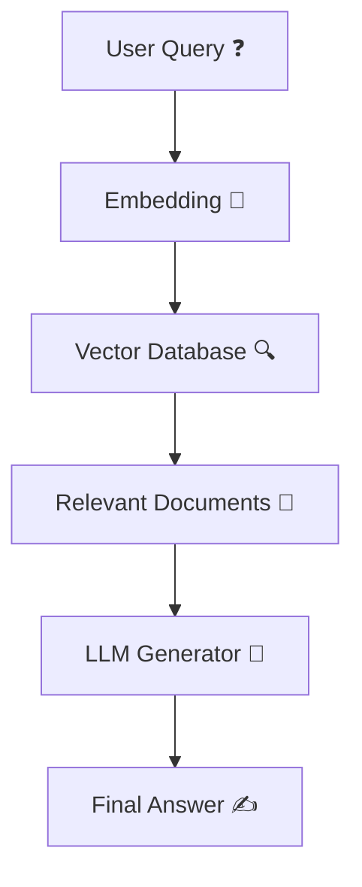
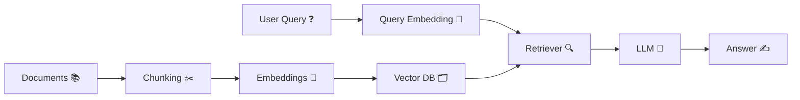

## 🤖 What is RAG (Retrieval-Augmented Generation)?

---

## 🧠 1. Simple Definition + Detailed Explanation

**RAG = Retrieval 🔍 + Generation ✍️**

👉 In simple terms:
RAG is a method where an AI **first searches for relevant information** from external data 📚 and then **uses that information to generate a more accurate answer**.

---

### 🪄 Intuition

Think of RAG like an **open-book exam** 📖:

* ❌ Normal AI → answers from memory
* ✅ RAG → *looks up information first, then answers*

---

### 🔄 How RAG Works

1. **User asks a question** ❓
2. **Convert question to vector (embedding)** 🔢
3. **Search similar data in vector DB** 🔍
4. **Fetch relevant chunks** 📄
5. **Send to LLM** 🤖
6. **Generate final answer** ✍️

---

### 🧩 Architecture Diagram



---

## ⚙️ 2. How to Implement a Simple RAG

### 🧱 Step-by-Step Implementation

---

### 🥇 Step 1: Prepare Data 📚

* Collect documents (PDFs, DB, APIs)
* Example:

  * HR policies
  * Product catalogs
  * Logs

---

### 🥈 Step 2: Chunk the Data ✂️

* Split large text into small pieces
* Example:

  * 500–1000 tokens per chunk

---

### 🥉 Step 3: Create Embeddings 🔢

* Convert text → vectors using embedding model

---

### 🏪 Step 4: Store in Vector DB 🗂️

* Store embeddings in:

  * FAISS
  * Pinecone
  * Chroma

---

### 🧠 Step 5: Build Retriever 🔍

* Input query → embedding
* Find similar chunks

---

### 🤖 Step 6: Generate Answer

* Pass:

  * Query + Retrieved context → LLM

---

### 🔄 Implementation Flow Diagram



---

### 💻 Simple Pseudo Code

```python
# 1. Embed documents
doc_vectors = embed(docs)

# 2. Store in vector DB
vector_db.store(doc_vectors)

# 3. Query
query_vector = embed(user_query)

# 4. Retrieve
results = vector_db.search(query_vector)

# 5. Generate answer
answer = llm.generate(query=user_query, context=results)
```

---

## 🌍 3. Real-world Examples

---

### 🏢 1. Company Chatbot

* ❓ “What is WFH policy?”
* 🔍 Retrieves HR doc
* 🤖 Generates accurate company-specific answer

---

### 🛒 2. E-commerce Assistant

* ❓ “Best phone under ₹30k?”
* 🔍 Retrieves product list
* ✍️ Suggests options with comparison

---

### 🏥 3. Healthcare Assistant

* ❓ “Latest diabetes treatment?”
* 🔍 Retrieves medical articles
* 🤖 Gives updated response

---

### 📊 4. Analytics Assistant

* ❓ “Sales last month?”
* 🔍 Queries DB
* ✍️ Summarizes insights

---

### 📄 5. Document Q&A

* Upload PDF
* ❓ “Summarize clause 5”
* 🔍 Retrieves relevant section
* ✍️ Provides summary

---

### 🧑‍💻 6. Developer Support Bot

* ❓ “Why am I getting HTTP 502?”
* 🔍 Searches logs/docs
* 🤖 Suggests root cause

---

## ✅ 4. Advantages of RAG

### 🚀 Benefits

* 🎯 **High accuracy**
  Grounded in real data

* ⏳ **Up-to-date information**
  No need to retrain model

* 🏢 **Custom knowledge**
  Works with internal data

* 📉 **Reduced hallucination**
  Uses real references

* 📈 **Scalable**
  Handles large datasets

---

## ⚙️ Requirements of RAG

### 🧱 Core Components

1. 📚 **Knowledge Source**

   * PDFs, DBs, APIs

2. 🔢 **Embedding Model**

   * Converts text → vectors

3. 🗂️ **Vector Database**

   * Stores embeddings

4. 🔍 **Retriever**

   * Finds relevant data

5. 🤖 **LLM**

   * Generates answer

---

### 🛠️ Optional Enhancements

* 🧹 Data cleaning
* 📊 Re-ranking results
* 🧠 Memory / chat history
* 🔐 Access control

---

## 🧠 Final Intuition

> 🤖 “I don’t just guess the answer…
> 🔍 I search your data first…
> ✍️ Then I answer with context.”
