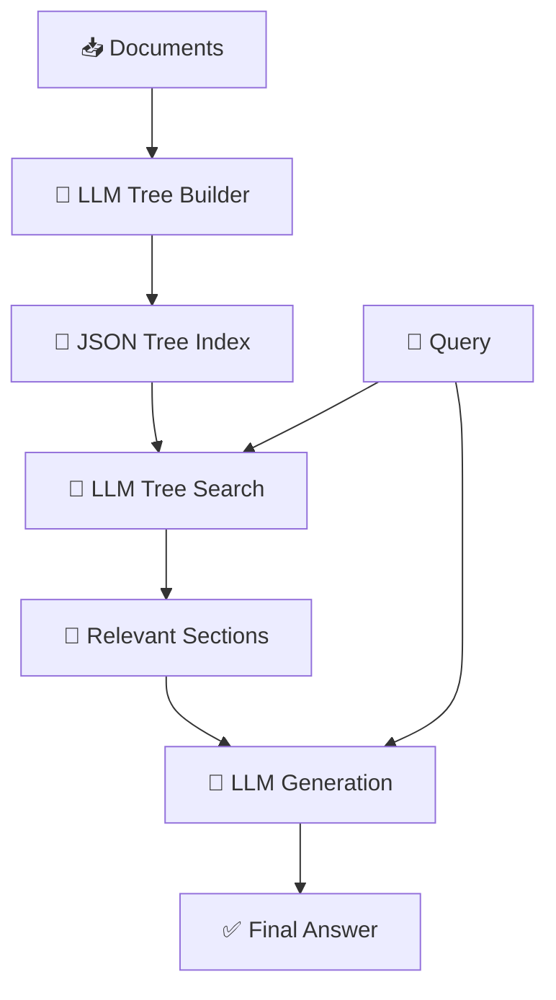
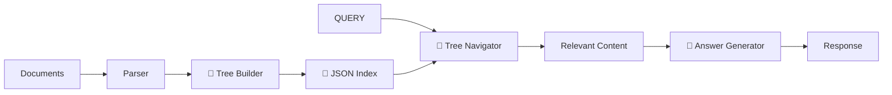

## 🌳 Vectorless RAG (RAG without Vector Databases)

Vectorless RAG is an alternative approach to traditional RAG where **you don’t rely on embeddings or vector databases**. Instead, it uses **structured representations (like trees, hierarchies, or indexes)** built with LLMs to retrieve relevant information.

---

# 🧠 1. Concept in Detail

## 🔍 What is Vectorless RAG?

👉 Simple definition:

> **Vectorless RAG = Retrieve using structure (tree/index) instead of embeddings**

Instead of:

* 🔢 Converting text → vectors
* 🔎 Doing similarity search

It does:

* 🌳 Build a hierarchical structure
* 🧠 Use LLM to navigate and retrieve

---

## 🧩 Core Idea

👉 Traditional RAG:

* “Find similar meaning using vectors”

👉 Vectorless RAG:

* “Understand document structure and navigate it intelligently”

---

## 🌳 Key Components

### 1. 🌲 LLM Tree Builder

* Reads documents
* Creates:

  * Sections
  * Subsections
  * Headings

👉 Output:

```json
{
  "title": "AI Guide",
  "sections": [
    {
      "title": "Introduction",
      "children": []
    },
    {
      "title": "RAG",
      "children": [
        { "title": "Traditional RAG" },
        { "title": "Agentic RAG" }
      ]
    }
  ]
}
```

---

### 2. 🗂 JSON Tree Index

* Stores document structure
* Acts like:

  * Table of contents 📑
  * Navigation map 🗺️

---

### 3. 🔎 LLM Tree Search

* Instead of vector similarity:

  * LLM selects relevant sections

👉 Example:

* Query: “Explain Agentic RAG”
* LLM:

  * Navigates → RAG → Agentic RAG section

---

### 4. 📄 Content Extraction

* Retrieve only relevant sections
* Feed into LLM for generation

---

### 5. 🤖 Generation

* Same as RAG:

  * Combine query + retrieved content
  * Generate final answer

---

## 🔄 End-to-End Flow



---

## 🧠 Special Case: No Table of Contents (Your Point)

If PDF has no structure:

👉 LLM:

* Reads pages 📄
* Infers:

  * Headings
  * Sections
  * Hierarchy

👉 Builds structure automatically

---

## 🧠 Key Insight

👉 Vector RAG = “Search by similarity”
👉 Vectorless RAG = “Navigate like a human reading a book”

---

# ⚙️ 2. How to Implement

## 🏗️ Architecture



---

## 🧪 Step-by-Step Implementation

### Step 1: Parse Documents

```python id="zj4b54"
pages = load_pdf("file.pdf")
```

---

### Step 2: Build Tree (LLM)

```python id="rzj14s"
tree = llm.generate_structure(pages)
```

---

### Step 3: Store JSON Index

```python id="vq3l6z"
save(tree, "index.json")
```

---

### Step 4: Query Processing

```python id="3r5h0f"
relevant_nodes = llm.find_relevant_sections(query, tree)
```

---

### Step 5: Retrieve Content

```python id="0jgm3z"
content = extract_sections(relevant_nodes)
```

---

### Step 6: Generate Answer

```python id="4f6n2x"
response = llm.generate(query + content)
```

---

# 🌍 3. Real-World Scenarios

## 📄 Scenario 1: PDF Analysis

* No TOC
* LLM builds structure
* Enables smart navigation

---

## 📚 Scenario 2: Legal Documents

* Contracts with sections
* Clause-based retrieval

---

## 📘 Scenario 3: Books / Manuals

* Chapters → sections → subsections
* Hierarchical search

---

## 🏢 Scenario 4: Enterprise Docs

* Policies
* Structured navigation

---

## 💻 Scenario 5: Code Documentation

* Modules → classes → functions
* Tree-based lookup

---

# ⚡ 4. Advantages & Requirements

## ✅ Advantages

### 🚫 No Vector DB Needed

* Simpler infra
* Lower cost

---

### 🌳 Structure-Aware Retrieval

* Better for:

  * PDFs
  * Books
  * Legal docs

---

### 🧠 Human-like Navigation

* Logical section traversal

---

### 📉 Reduced Embedding Errors

* No semantic mismatch issues

---

### 💡 Better Context Grouping

* Retrieves coherent sections

---

## ⚠️ Requirements

### 🧠 Strong LLM

* Needs good reasoning
* Tree building + navigation

---

### 📄 Structured Data Works Best

* Poor for:

  * Unstructured chat logs

---

### ⚡ Latency

* LLM used in retrieval → slower

---

### 🔁 Consistency Challenges

* Tree generation must be stable

---

### 📊 Storage

* JSON index management

---

# ⚠️ Limitations

* ❌ Not ideal for semantic similarity tasks
* ❌ Depends heavily on LLM quality
* ❌ May miss relevant info if structure is wrong

---

# 🔄 Vector RAG vs Vectorless RAG

| Feature   | Vector RAG 🔢     | Vectorless RAG 🌳 |
| --------- | ----------------- | ----------------- |
| Retrieval | Similarity search | Tree navigation   |
| Infra     | Vector DB         | JSON index        |
| Speed     | Faster            | Slower            |
| Best for  | Unstructured data | Structured docs   |
| Accuracy  | Semantic          | Logical           |

---

# 🧠 Final Intuition

👉 Think of two approaches:

### 🔢 Vector RAG

Like Google search:

* “Find similar meaning”

---

### 🌳 Vectorless RAG

Like reading a book:

* “Go to chapter → section → topic”

---

# 🔮 When Should You Use Vectorless RAG?

Use when:

* Documents are **structured**
* No need for vector DB
* You want **logical navigation**

Avoid when:

* Data is **unstructured**
* Need **fast retrieval at scale**
