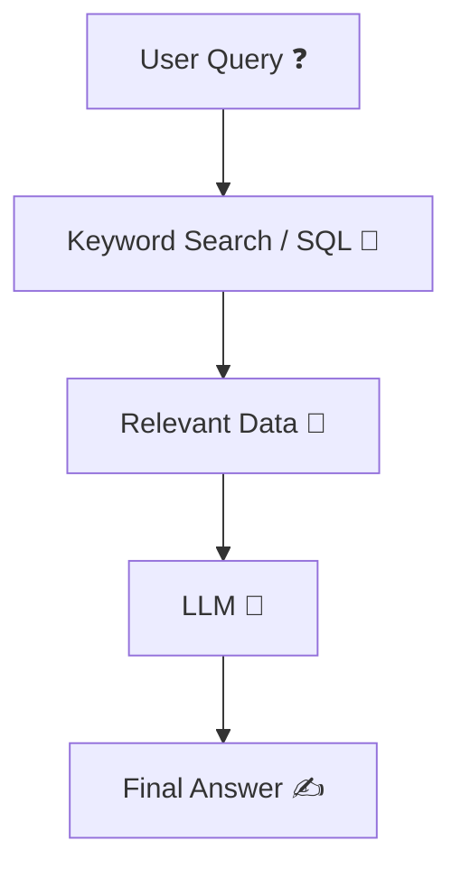
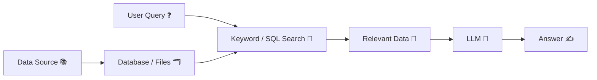

## 🤖 What is **Vector-less RAG**?

---

### 📌 Simple Definition

**Vector-less RAG = Retrieval without embeddings 🔍❌🔢 + Generation 🤖**

👉 In simple terms:
It is a RAG system where we **do NOT use vector embeddings or vector databases**, but instead **retrieve data using traditional methods** like:

* Keyword search 🔎
* SQL queries 📊
* Filters / rules ⚙️

…and then pass that data to an LLM to generate answers.

---

### 🪄 Intuition

Think of it like:

> 📚 Instead of “semantic search (meaning-based)”
> 🔎 You use “exact search (keyword-based)”

---

### 🧩 How it differs from normal RAG

| Feature     | Normal RAG 🧠      | Vector-less RAG 🔎   |
| ----------- | ------------------ | -------------------- |
| Search type | Semantic (meaning) | Keyword / rule-based |
| Embeddings  | Required 🔢        | Not required ❌       |
| Vector DB   | Required 🗂️       | Not needed ❌         |
| Complexity  | Higher ⚙️          | Simpler ✅            |

---

### 🔄 How Vector-less RAG Works

1. User asks question ❓
2. System performs:

   * Keyword search 🔎 OR
   * SQL query 📊 OR
   * API lookup 🌐
3. Retrieves matching data 📄
4. Sends data + question to LLM 🤖
5. Generates answer ✍️

---

### 📊 Architecture Diagram



---

## ⚙️ 2. How to Implement Vector-less RAG

---

### 🧱 Step-by-Step Approach

---

### 🥇 Step 1: Prepare Data 📚

* Store data in:

  * Database (BigQuery, PostgreSQL)
  * Files (CSV, JSON, PDFs)

---

### 🥈 Step 2: Choose Retrieval Method 🔎

You can use:

#### Option A: Keyword Search

* LIKE queries
* Full-text search

#### Option B: SQL-based Retrieval 📊

```sql
SELECT * 
FROM policies
WHERE content LIKE '%leave policy%'
```

#### Option C: Rule-based Filters ⚙️

* Predefined mappings
* Tags/categories

---

### 🥉 Step 3: Fetch Relevant Data 📄

* Limit results (top N rows)
* Clean text

---

### 🤖 Step 4: Send to LLM

```python
prompt = f"""
Answer the question using the below data:

{retrieved_data}

Question: {user_query}
"""
```

---

### 🔄 Implementation Flow



---

## 🌍 3. Real-world Examples

---

### 🏢 1. HR Policy Bot

* ❓ “WFH rules?”
* 🔎 SQL search in HR table
* 🤖 Generates answer from retrieved rows

---

### 📊 2. Analytics Query System

* ❓ “Sales in May?”
* 📊 Direct SQL query:

  ```sql
  SELECT SUM(sales) FROM transactions WHERE month = 'May'
  ```
* ✍️ LLM formats response

---

### 🛒 3. E-commerce Search

* ❓ “Shoes under ₹2000”
* 🔎 Filter query:

  * price < 2000
* 🤖 Generates recommendation

---

### 🧾 4. Log Analysis System

* ❓ “Why HTTP 502 error?”
* 🔎 Search logs:

  * WHERE status = 502
* 🤖 Explains issue

---

### 📄 5. FAQ Chatbot

* ❓ “Refund policy?”
* 🔎 Match keywords in FAQ table
* ✍️ Generate response

---

### 🧑‍💻 6. Internal Tooling (Your Use Case 🚀)

* Query optimization logs / pipeline data
* 🔎 Search based on:

  * query_id
  * error_code
* 🤖 Generate insights

---

## ✅ 4. Advantages of Vector-less RAG

---

### 🚀 Benefits

* ⚡ **Simple to implement**
* 💰 **Low cost** (no embeddings, no vector DB)
* 🧩 **Easy debugging**
* 📊 **Works great with structured data**
* 🔐 **Better control using SQL/filters**

---

## ⚠️ Limitations (Important)

* ❌ Cannot understand meaning (semantic gaps)
* ❌ Misses results if keywords differ
* ❌ Less flexible than vector RAG

👉 Example:

* “WFH policy” ≠ “work from home rules” (may fail)

---

## ⚙️ Requirements

---

### 🧱 Core Components

1. 📚 **Data Source**

   * DB / files / APIs

2. 🔎 **Search Mechanism**

   * SQL / keyword search

3. 🧹 **Data Cleaning**

   * Extract relevant text

4. 🤖 **LLM**

   * Generate response

---

### 🛠️ Optional Enhancements

* 🧠 Synonym mapping (WFH = Work from home)
* 🔍 Full-text search engines (Elasticsearch)
* 📊 Ranking logic (ORDER BY relevance)
* 🧾 Query rewriting

---

## 🔀 When to Use Vector-less RAG vs Normal RAG

| Use Case                       | Best Choice   |
| ------------------------------ | ------------- |
| Structured data (DB tables) 📊 | ✅ Vector-less |
| Logs / analytics 🔍            | ✅ Vector-less |
| Semantic search (documents) 📚 | ✅ Vector RAG  |
| Large unstructured data        | ✅ Vector RAG  |

---

## 🧠 Final Intuition

> 🔎 Vector-less RAG = “Search like Google (keywords)”
> 🧠 Vector RAG = “Search like ChatGPT (meaning)”
