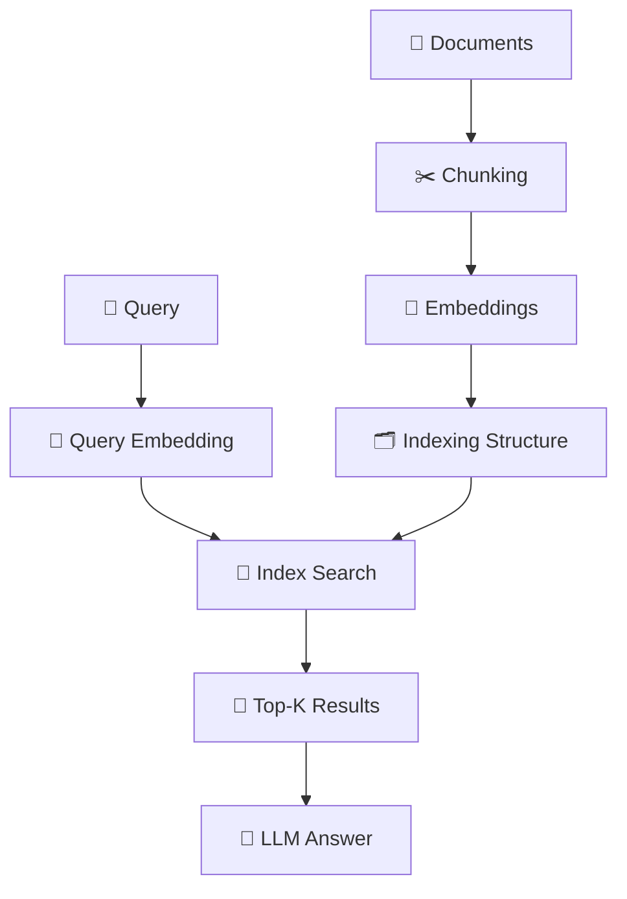
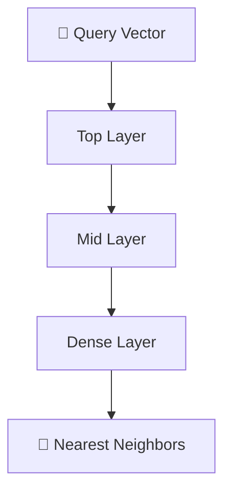
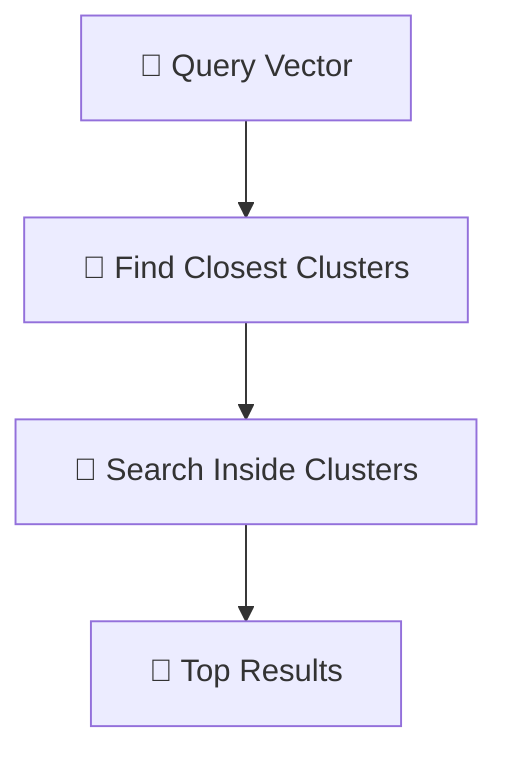
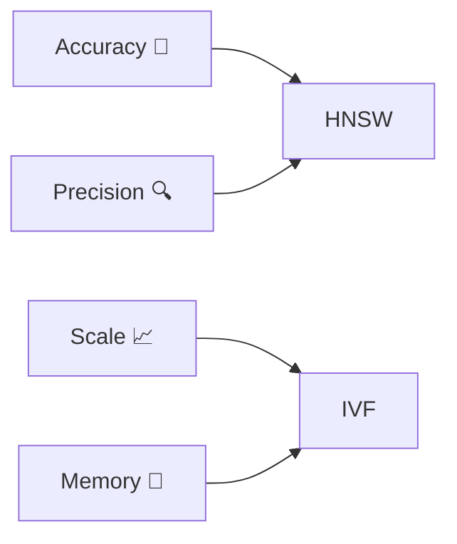

## 🧠 Indexing in RAG (and ⚔️ HNSW vs IVF)

Indexing is the **core performance engine** of any RAG system. It determines **how fast and how accurately** you can retrieve relevant documents.

---

# 🧠 1. Concept in Detail

## 🔍 What is Indexing in RAG?

👉 Simple definition:

> **Indexing = Organizing embeddings so you can search them efficiently**

Without indexing:

* ❌ You compare query with *every vector* (very slow)

With indexing:

* ✅ You search only *relevant subsets* (fast + scalable)

---

## 🧩 Where Indexing Fits in RAG



---

## ⚡ Why Indexing Matters

* 🚀 Speed (milliseconds vs seconds)
* 📈 Scalability (millions → billions)
* 🎯 Retrieval accuracy (approximate vs exact)

---

## 🔍 Types of Search

### 1. Exact Search (Brute Force)

* Compare with all vectors
* ✅ Accurate
* ❌ Very slow

---

### 2. Approximate Nearest Neighbor (ANN)

* Smart shortcuts
* ✅ Fast
* ⚠️ Slight accuracy trade-off

👉 HNSW and IVF are **ANN methods**

---

# ⚔️ 2. HNSW vs IVF (Core Comparison)

---

## 🌐 HNSW (Hierarchical Navigable Small World)

👉 Idea:

> “Build a graph where similar vectors are connected”

---

### 🧠 How It Works

* Vectors = nodes
* Edges = similarity connections
* Multi-layer graph:

  * Top = sparse (fast navigation)
  * Bottom = dense (accurate search)

---

### 🔄 HNSW Flow



---

### ✅ Advantages

* 🎯 Very high accuracy
* ⚡ Fast query time
* 🔍 Great for semantic search

---

### ❌ Disadvantages

* 💾 High memory usage
* 🏗 Build time is expensive
* 🔄 Harder to update dynamically

---

---

## 📦 IVF (Inverted File Index)

👉 Idea:

> “Cluster vectors → search only relevant clusters”

---

### 🧠 How It Works

1. Cluster vectors into groups (centroids)
2. At query time:

   * Find closest clusters
   * Search only inside them

---

### 🔄 IVF Flow



---

### ✅ Advantages

* 💾 Memory efficient
* ⚡ Faster for large datasets
* 📈 Scales very well

---

### ❌ Disadvantages

* 🎯 Lower accuracy than HNSW
* ⚠️ Sensitive to clustering quality
* 🔧 Requires tuning (nlist, nprobe)

---

# 📊 Quick Comparison

| Feature     | 🌐 HNSW | 📦 IVF |
| ----------- | ------- | ------ |
| Accuracy    | ⭐⭐⭐⭐⭐   | ⭐⭐⭐    |
| Speed       | ⭐⭐⭐⭐    | ⭐⭐⭐⭐   |
| Memory      | ❌ High  | ✅ Low  |
| Scalability | Medium  | High   |
| Build Time  | High    | Medium |
| Updates     | Hard    | Easier |

---

# ⚙️ 3. How to Implement

## 🧪 HNSW Example (FAISS)

```python id="p5q9nr"
import faiss

index = faiss.IndexHNSWFlat(dimension, 32)  # 32 = neighbors
index.add(embeddings)
```

---

## 🧪 IVF Example (FAISS)

```python id="rbns5h"
quantizer = faiss.IndexFlatL2(dimension)
index = faiss.IndexIVFFlat(quantizer, dimension, nlist=100)

index.train(embeddings)
index.add(embeddings)

index.nprobe = 10  # clusters to search
```

---

## ⚙️ Key Parameters

### HNSW

* `M` → number of connections
* `efSearch` → search accuracy

---

### IVF

* `nlist` → number of clusters
* `nprobe` → clusters searched

---

# 🌍 4. Real-World Scenarios

## 🌐 Use HNSW

### 💬 Chatbots

* Need high accuracy
* Small to medium datasets

---

### 📚 Knowledge Assistants

* Precision matters

---

### 🧠 Semantic Search

* Complex queries

---

## 📦 Use IVF

### 🛍️ E-commerce Search

* Millions of products

---

### 📊 Analytics Systems

* Large-scale data

---

### 🌐 Web-scale Search

* Speed + scale over perfection

---

# ⚡ 5. Advantages & Requirements

## ✅ Advantages of Indexing

* 🚀 Fast retrieval
* 📈 Scalable systems
* 🎯 Efficient search

---

## ⚠️ Requirements

### 🔢 Good Embeddings

* Garbage vectors → bad retrieval

---

### ⚙️ Proper Tuning

* HNSW: efSearch
* IVF: nprobe

---

### 💻 Infrastructure

* Memory (HNSW)
* Compute (IVF clustering)

---

### 🔄 Maintenance

* Re-indexing when data changes

---

# ⚠️ Trade-Off Summary



---

# 🧠 Final Intuition

👉 Think of it like this:

### 🌐 HNSW

* Like navigating a **social network**
* Jump from friend → friend → closest match

---

### 📦 IVF

* Like searching in a **library**
* First pick the right section → then find book

---

# 🔮 When to Use What

## ✅ Use HNSW When:

* Accuracy is critical 🎯
* Dataset is moderate
* Memory is not a constraint

---

## ✅ Use IVF When:

* Dataset is huge 📈
* Need scalability
* Memory is limited

---

## 🔥 Best Practice

👉 Many production systems use:

* Hybrid approaches (IVF + HNSW)
* Multi-stage retrieval

---

# 🏁 Final Thought

> **Indexing is the difference between a slow demo and a production-grade RAG system 🚀**
