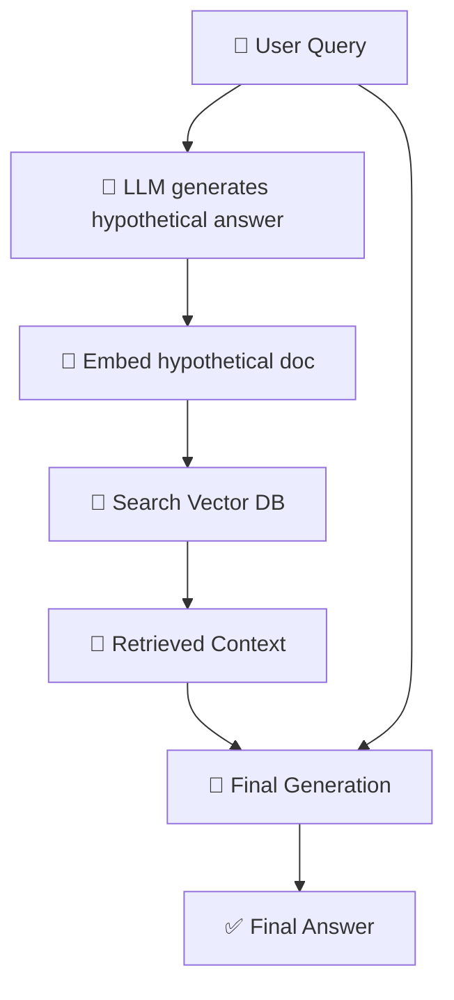
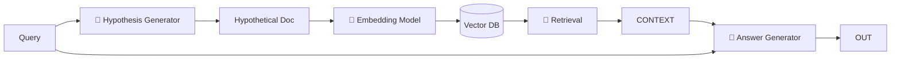

## 🧠 HyDE (Hypothetical Document Embedding)

HyDE is a clever technique used in RAG systems to **improve retrieval quality** by generating a *fake (hypothetical) answer first*, and then using it to search for real documents.

---

# 🚀 1. Concept in Detail

## 🔍 What is HyDE?

👉 Simple definition:

> **HyDE = Generate a hypothetical answer → embed it → use it to retrieve better documents**

---

## 🤯 Why is HyDE Needed?

In normal RAG:

* Query → embedding → search

❌ Problem:

* Queries are often:

  * Short
  * Ambiguous
  * Missing context

👉 Result:

* Poor retrieval quality

---

## 💡 HyDE Solution

👉 Instead of embedding the *query*, we:

1. 🧠 Generate a **hypothetical answer/document**
2. 🔢 Convert that into an embedding
3. 🔎 Use it for retrieval

---

## 🔁 HyDE Flow



---

## 🧠 Key Insight

👉 Query:

> “Why is my app slow?”

👉 Hypothetical doc:

> “Application performance issues can be caused by memory leaks, inefficient database queries, or high CPU usage…”

👉 This gives:

* Rich context
* Better semantic signal

---

## 🧩 Important Concepts

### 1. 🧠 Hypothetical Document

* Generated by LLM
* Looks like a real answer
* Adds missing context

---

### 2. 🔢 Embedding the Hypothesis

* Not the query!
* More informative representation

---

### 3. 🔎 Retrieval

* Finds documents similar to the *hypothesis*

---

### 4. 🤖 Final Generation

* Uses:

  * Real retrieved docs
  * Original query

---

# ⚙️ 2. How to Implement

## 🏗️ Architecture



---

## 🧪 Step-by-Step Implementation

### Step 1: Generate Hypothetical Answer

```python id="p92e2n"
hypothesis = llm.generate(
  "Write a detailed answer for: " + user_query
)
```

---

### Step 2: Embed Hypothesis

```python id="v5qgyg"
hypo_vec = embed_model.encode(hypothesis)
```

---

### Step 3: Retrieve Documents

```python id="zexm1g"
results = vector_db.search(hypo_vec, top_k=5)
```

---

### Step 4: Generate Final Answer

```python id="9kdxah"
context = combine(results)
final_answer = llm.generate(user_query + context)
```

---

## 🔥 Optional Enhancements

* 🔁 Multiple hypotheses (multi-HyDE)
* ⚖️ Re-ranking retrieved docs
* 🧠 Combine query + hypothesis embeddings

---

# 🌍 3. Real-World Scenarios

## 💻 Scenario 1: Debugging Assistant

**Query:** “Why is my API timing out?”

👉 Hypothesis includes:

* Network latency
* DB bottlenecks
* Timeout configs

➡️ Better retrieval from logs/docs

---

## 📚 Scenario 2: Academic Search

**Query:** “Explain transformer attention”

👉 Hypothesis:

* Detailed explanation of attention mechanism

➡️ Retrieves better research papers

---

## 🏥 Scenario 3: Medical QA

**Query:** “Symptoms of condition X”

👉 Hypothesis:

* Full symptom list

➡️ Retrieves accurate medical docs

---

## 🛍️ Scenario 4: E-commerce Search

**Query:** “Best budget gaming laptop”

👉 Hypothesis:

* Specs, GPU, RAM, benchmarks

➡️ Better product matching

---

## 💬 Scenario 5: Customer Support

**Query:** “Payment failed”

👉 Hypothesis:

* Possible causes:

  * insufficient funds
  * network issue
  * bank decline

➡️ Better FAQ retrieval

---

# ⚡ 4. Advantages & Requirements

## ✅ Advantages

### 🎯 Better Retrieval Quality

* Richer semantic signal

---

### 🧠 Handles Vague Queries

* Expands missing context

---

### 🔍 Improves Recall

* Finds more relevant documents

---

### 🚀 Works with Existing RAG

* Easy to plug in

---

### 💡 Reduces Query Ambiguity

* Makes search more precise

---

## ⚠️ Requirements

### 🧠 Strong LLM

* Needs good hypothesis generation

---

### ⚡ Extra Latency

* One extra LLM call

---

### 💸 Higher Cost

* Additional compute

---

### 🔁 Prompt Tuning

* Hypothesis quality matters

---

# ⚠️ Limitations

* ❌ Wrong hypothesis → bad retrieval
* ❌ Over-generalization
* ❌ Adds latency

---

# 🔄 Normal RAG vs HyDE

| Feature            | 📚 RAG | 🧠 HyDE          |
| ------------------ | ------ | ---------------- |
| Input to embedding | Query  | Hypothetical doc |
| Context richness   | Low    | High             |
| Retrieval quality  | Medium | High             |
| Cost               | Low    | Medium           |
| Complexity         | Simple | Moderate         |

---

# 🧠 Final Intuition

👉 Think of HyDE like this:

### Without HyDE

* 🔎 Search using a short query

---

### With HyDE

* 🧠 First write a “perfect answer”
* 🔎 Then search using that

---

# 🔮 When Should You Use HyDE?

## ✅ Use HyDE When:

* Queries are **short / vague**
* Need **better retrieval accuracy**
* Domain is **complex**

---

## ❌ Avoid HyDE When:

* Queries are already detailed
* Latency must be very low
* Cost constraints are strict

---

# 🏁 Final Thought

👉 HyDE is a **simple but powerful upgrade** to RAG:

> “Don’t search with the question…
> search with what the answer *should look like*.”
