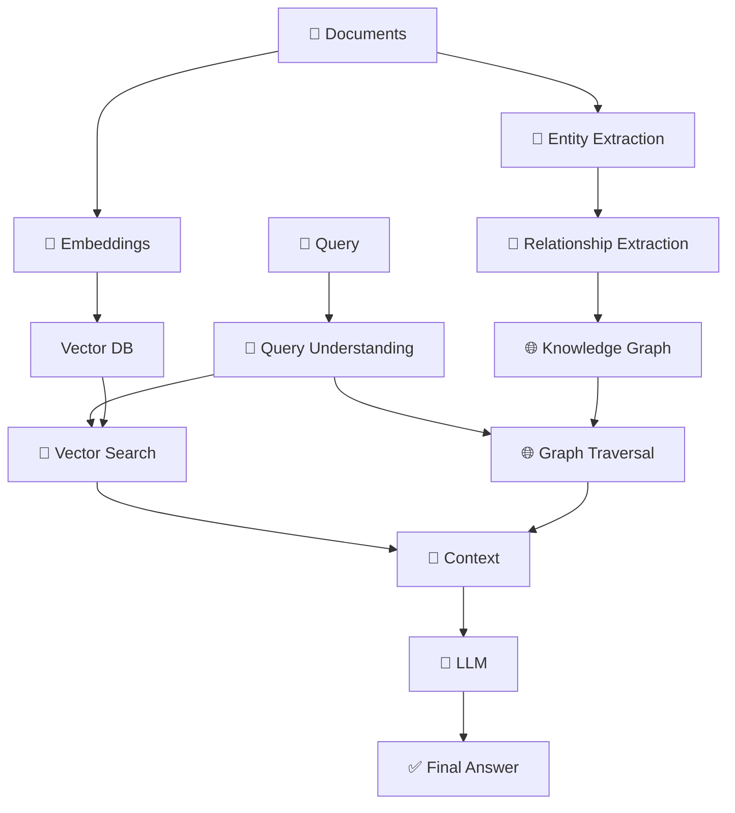
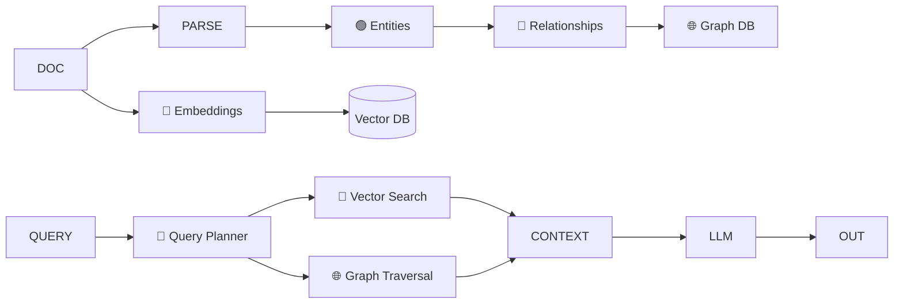

## 🧠 Graph RAG (Retrieval-Augmented Generation with Knowledge Graphs)

Graph RAG is an advanced RAG approach that combines **vector search 🔢 + knowledge graphs 🌐** to capture not just *documents*, but also the **relationships between entities**.

---

# 🧠 1. Concept in Detail

## 🔍 What is Graph RAG?

👉 Simple definition:

> **Graph RAG = RAG + Knowledge Graph → Retrieval with relationships**

---

## 🤯 Why Do We Need Graph RAG?

Traditional RAG:

* Retrieves **isolated chunks** 📄
* ❌ Misses relationships between data

👉 Example problem:

* “Who manages the team that built product X?”

Normal RAG:

* May retrieve:

  * Product info
  * Team info
* ❌ But fails to connect them

---

## 💡 Graph RAG Solution

👉 Build a **knowledge graph**:

* Entities → Nodes 🟢
* Relationships → Edges 🔗

👉 Then:

* Traverse relationships
* Retrieve connected context

---

## 🧩 Core Components

### 1. 🟢 Entity Extraction

* Identify:

  * People
  * Organizations
  * Products
  * Concepts

---

### 2. 🔗 Relationship Extraction

* Define connections:

  * “works_at”
  * “built_by”
  * “depends_on”

---

### 3. 🌐 Knowledge Graph

* Structured graph:

```plaintext
Alice → works_at → CompanyX
CompanyX → built → ProductY
```

---

### 4. 🔎 Hybrid Retrieval

* Combine:

  * 🔢 Vector search (semantic)
  * 🌐 Graph traversal (relationships)

---

### 5. 🤖 Answer Generation

* LLM uses:

  * Retrieved documents
  * Graph context

---

## 🔄 Graph RAG Flow



---

## 🧠 Key Insight

👉 Traditional RAG:

* “Find similar text”

👉 Graph RAG:

* “Find related knowledge across entities”

---

# ⚙️ 2. How to Implement

## 🏗️ Architecture



---

## 🧪 Step-by-Step Implementation

### Step 1: Extract Entities & Relationships

```python id="2j3p3k"
entities = llm.extract_entities(text)
relations = llm.extract_relations(text)
```

---

### Step 2: Build Knowledge Graph

```python id="u1fdlt"
graph.add_nodes(entities)
graph.add_edges(relations)
```

---

### Step 3: Store in Graph DB

* Neo4j
* Amazon Neptune
* TigerGraph

---

### Step 4: Setup Vector DB

```python id="5s4g9u"
vector_db.add(chunks, embeddings)
```

---

### Step 5: Query Processing

```python id="0xv7tv"
vector_results = vector_db.search(query)
graph_results = graph.traverse(query_entities)
```

---

### Step 6: Combine & Generate

```python id="1x7r0b"
context = merge(vector_results, graph_results)
answer = llm.generate(query + context)
```

---

# 🌍 3. Real-World Scenarios

## 🏢 Scenario 1: Enterprise Knowledge Graph

**Query:** “Who leads the project using tool X?”

* Graph connects:

  * Project → Team → Manager

---

## 🏥 Scenario 2: Healthcare Systems

**Query:** “Drugs interacting with condition Y”

* Graph connects:

  * Drug → condition → side effects

---

## 💻 Scenario 3: Code Intelligence

**Query:** “Which service depends on module X?”

* Graph:

  * Service → dependency → module

---

## 📊 Scenario 4: Financial Analysis

**Query:** “Companies affected by supplier Z”

* Graph:

  * Supplier → companies → market impact

---

## 🌐 Scenario 5: Research & Academia

**Query:** “Papers related to author X’s work”

* Graph:

  * Author → papers → citations

---

# ⚡ 4. Advantages & Requirements

## ✅ Advantages

### 🌐 Relationship Awareness

* Understands connections

---

### 🧠 Multi-hop Reasoning

* Can answer:

  * “A → B → C” queries

---

### 🎯 Better Context

* More complete answers

---

### 🔍 Reduced Fragmentation

* Avoids isolated chunk retrieval

---

### 🔥 Powerful for Complex Queries

* Especially:

  * Enterprise
  * Healthcare
  * Finance

---

## ⚠️ Requirements

### 🧠 Entity & Relation Extraction

* Needs good NLP/LLM

---

### 🌐 Graph Database

* Neo4j, etc.

---

### ⚙️ Hybrid Retrieval Logic

* Combine vector + graph

---

### 💻 Infrastructure Complexity

* More moving parts

---

### 🔄 Maintenance

* Updating graph is non-trivial

---

# ⚠️ Limitations

* ❌ Complex to build
* ❌ Graph quality affects results
* ❌ Higher latency
* ❌ Overkill for simple use cases

---

# 📊 Graph RAG vs Traditional RAG

---

# 🧠 Final Intuition

👉 Think of it like this:

### 📚 RAG

* Like searching **documents**

---

### 🌐 Graph RAG

* Like exploring a **knowledge network**

---

👉 Example:

* RAG:

  * Finds “Product X info”

* Graph RAG:

  * Finds:

    * Product X
    * Built by Team Y
    * Managed by Person Z

---

# 🔮 When Should You Use Graph RAG?

## ✅ Use Graph RAG When:

* Relationships matter 🔗
* Queries require multi-step reasoning
* Data is interconnected

---

## ❌ Avoid When:

* Simple FAQ systems
* No relational data
* Need low latency

---

# 🏁 Final Thought

> **Graph RAG turns your system from a “search engine” into a “reasoning engine” 🧠🌐**
