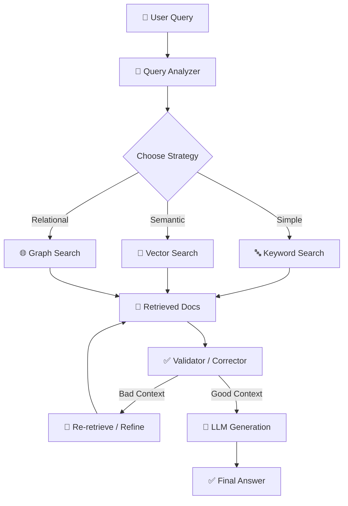
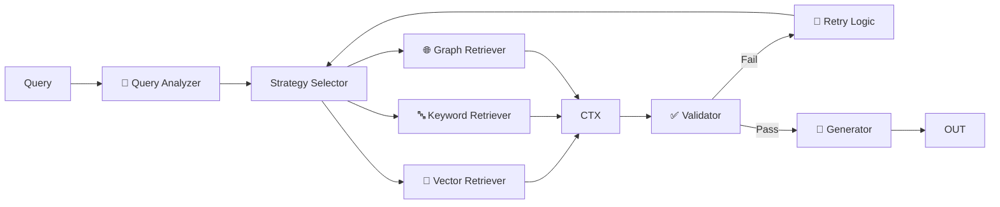

## 🧠 Adaptive / Corrective RAG (Smart & Self-Checking RAG)

Adaptive/Corrective RAG is a **next-generation RAG architecture** that makes systems more **intelligent, flexible, and reliable** by:

* 🧭 **Adapting retrieval strategy dynamically**
* ✅ **Validating and correcting retrieved information**

---

# 🧠 1. Concept in Detail

## 🔍 What is Adaptive / Corrective RAG?

👉 Simple definition:

> **Adaptive RAG = Choose the best retrieval strategy based on the query**
> **Corrective RAG = Validate and fix retrieved results before answering**

---

## 🤯 Why Do We Need It?

Traditional RAG:

* Uses **fixed retrieval strategy** ❌
* Assumes retrieved data is correct ❌

👉 Problems:

* Wrong documents retrieved
* No validation step
* Poor answers for complex queries

---

## 💡 Solution: Adaptive + Corrective Layers

### 🧭 Adaptive RAG (Dynamic Strategy Selection)

The system:

* Understands query type
* Chooses best approach

👉 Examples:

* Simple query → keyword search 🔤
* Complex query → vector search 🔢
* Relationship query → graph traversal 🌐

---

### ✅ Corrective RAG (Validation Layer)

Before answering:

* 🧠 Checks retrieved content
* 🔁 Refines or re-retrieves if needed
* ⚠️ Filters incorrect info

---

## 🔄 Full Adaptive + Corrective Flow



---

## 🧠 Key Concepts

### 1. 🧭 Query Classification

* Identify:

  * Intent
  * Complexity
  * Domain

---

### 2. 🔀 Strategy Selection

* Choose:

  * Vector search
  * Keyword search
  * Graph RAG
  * Hybrid

---

### 3. ✅ Context Validation

* Check:

  * Relevance
  * Consistency
  * Completeness

---

### 4. 🔁 Correction Loop

* If bad context:

  * Refine query
  * Retry retrieval

---

### 5. 🤖 Final Generation

* Only after validation

---

# ⚙️ 2. How to Implement

## 🏗️ Architecture



---

## 🧪 Step-by-Step Implementation

### Step 1: Query Analyzer

```python
query_type = classify_query(user_query)
```

---

### Step 2: Strategy Selection

```python
if query_type == "simple":
    retriever = keyword_search
elif query_type == "semantic":
    retriever = vector_search
else:
    retriever = graph_search
```

---

### Step 3: Retrieve Context

```python
docs = retriever(user_query)
```

---

### Step 4: Validate Context

```python
is_valid = llm.check_relevance(user_query, docs)
```

---

### Step 5: Correction Loop

```python
if not is_valid:
    refined_query = llm.refine_query(user_query)
    docs = retriever(refined_query)
```

---

### Step 6: Generate Answer

```python
response = llm.generate(user_query + docs)
```

---

## 🔥 Enhancements

* 🧠 Use **HyDE** for better retrieval
* ⚖️ Add **re-ranking models**
* 🔍 Multi-retriever ensemble

---

# 🌍 3. Real-World Scenarios

## 💬 Scenario 1: Customer Support Bot

**Query:** “My payment failed”

* Adaptive:

  * Chooses FAQ + logs
* Corrective:

  * Filters irrelevant responses

---

## 💻 Scenario 2: Developer Assistant

**Query:** “Fix memory leak in service X”

* Adaptive:

  * Uses code search + logs
* Corrective:

  * Validates solution relevance

---

## 🏥 Scenario 3: Medical Assistant

**Query:** “Treatment for condition X”

* Adaptive:

  * Uses research + guidelines
* Corrective:

  * Cross-checks sources

---

## 🏢 Scenario 4: Enterprise Knowledge Bot

**Query:** “Who owns project Y?”

* Adaptive:

  * Uses graph + docs
* Corrective:

  * Verifies ownership data

---

## 📊 Scenario 5: Analytics Assistant

**Query:** “Why did revenue drop?”

* Adaptive:

  * Queries DB + reports
* Corrective:

  * Ensures consistency

---

# ⚡ 4. Advantages & Requirements

## ✅ Advantages

### 🧠 Smarter Retrieval

* Chooses best method dynamically

---

### 🎯 Higher Accuracy

* Validation reduces hallucinations

---

### 🔁 Self-Correcting

* Fixes bad retrieval

---

### 🔀 Flexible

* Supports multiple retrieval types

---

### 🔍 Better for Complex Queries

* Handles multi-step reasoning

---

## ⚠️ Requirements

### 🧠 Strong LLM

* For:

  * Classification
  * Validation
  * Correction

---

### ⚙️ Multiple Retrievers

* Vector DB
* Keyword search
* Graph DB

---

### 📊 Observability

* Track decisions & retries

---

### ⚡ Performance Optimization

* Avoid too many loops
* Control latency

---

### 🔐 Guardrails

* Prevent infinite retries

---

# ⚠️ Limitations

* ❌ Higher latency
* ❌ More complex system
* ❌ Cost increases (multiple steps)

---

# 📊 Traditional RAG vs Adaptive/Corrective RAG

---

# 🧠 Final Intuition

👉 Think of it like this:

### 📚 Traditional RAG

* Ask once → answer

---

### 🧠 Adaptive RAG

* Think → choose best approach

---

### ✅ Corrective RAG

* Verify → fix → answer

---

👉 Combined:

> “Understand the question → choose best path → verify results → answer confidently”

---

# 🔮 When Should You Use It?

## ✅ Use Adaptive/Corrective RAG When:

* Queries are **complex or diverse**
* Accuracy is **critical**
* Multiple data sources exist

---

## ❌ Avoid When:

* Simple FAQ bots
* Low latency required
* Limited infrastructure

---

# 🏁 Final Thought

> **Adaptive/Corrective RAG transforms RAG from a “retrieval system” into a “thinking + verifying system” 🧠✅**
