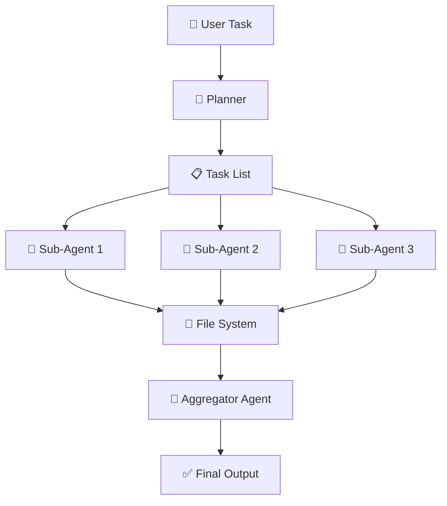
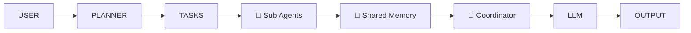

## 🧠 Deep Agents (Advanced Multi-Step AI Agents)

Deep Agents are **next-level AI systems** designed to handle **complex, multi-step, long-running tasks** by combining:

* 🧭 Planning
* 🤖 Multiple specialized sub-agents
* 📂 Persistent memory (file system)
* 🧠 Strong orchestration

---

# 🚀 1. Concept in Detail

## 🔍 What are Deep Agents?

👉 Simple definition:

> **Deep Agents = AI systems that plan, break down tasks, delegate to sub-agents, and use persistent memory to solve complex problems**

---

## 🤯 Why Do We Need Deep Agents?

Traditional agents:

* ❌ Limited context
* ❌ Single-step or shallow reasoning
* ❌ No persistent memory

---

👉 Deep Agents solve this by:

* 🧭 Planning tasks
* 🔁 Executing multi-step workflows
* 📂 Storing and reusing knowledge
* 🤖 Delegating to specialized agents

---

# 🧩 Core Components (Based on Your Points)

---

## 🧭 1. Planning Tool (Task Decomposer)

👉 Role:

* Converts input → **to-do list**

Example:

```plaintext id="t2cz1m"
User: "Analyze market trends and create a report"

Plan:
1. Collect market data
2. Analyze trends
3. Generate insights
4. Write report
```

---

## 🤖 2. Sub-Agents (Workers)

👉 Role:

* Execute each task independently

Examples:

* 📊 Data agent
* 🧠 Analysis agent
* ✍️ Writing agent

👉 Key idea:

* Multiple agents = parallel + specialized execution

---

## 🧠 3. System Prompt (Behavior Control)

👉 Defines:

* What the agent should do
* Rules & constraints
* Tone & objectives

---

## 📂 4. File System (Persistent Memory)

👉 Shared storage:

* All agents can read/write

Used for:

* 📄 Storing intermediate results
* 🔄 Communication between agents
* 🧠 Long-term memory

---

## 🔄 Deep Agent Flow



---

## 🧠 Key Insight

👉 Normal agent:

* “Think → act → answer”

👉 Deep agent:

* “Plan → delegate → collaborate → refine → answer”

---

# ⚙️ 2. How to Implement

## 🏗️ Architecture



---

## 🧪 Step-by-Step Implementation

### Step 1: Planning Module

```python id="r1g3s9"
tasks = planner.generate_plan(user_query)
```

---

### Step 2: Create Sub-Agents

```python id="9xtc9k"
agents = {
  "research": research_agent,
  "analysis": analysis_agent,
  "writer": writer_agent
}
```

---

### Step 3: Shared File System

```python id="l1aplw"
memory.write("research_notes", data)
memory.read("research_notes")
```

---

### Step 4: Execute Tasks

```python id="7qozq2"
for task in tasks:
    agent = select_agent(task)
    result = agent.execute(task)
    memory.store(task, result)
```

---

### Step 5: Aggregate Results

```python id="yydw42"
final = aggregator.combine(memory)
```

---

## 🔥 Advanced Features

* 🔁 Iterative refinement
* ⚡ Parallel execution
* 🧠 Feedback loops
* 🛠 Tool usage (APIs, DBs)

---

# 🌍 3. Real-World Scenarios

## 📊 Scenario 1: Deep Research Assistant

👉 Like:

* ChatGPT Deep Research
* Claude research mode

Flow:

* Collect sources
* Analyze
* Summarize
* Generate report

---

## 💻 Scenario 2: Software Development Agent

Task:

* Build a feature

Agents:

* 🧠 Planner
* 👨‍💻 Coding agent
* 🧪 Testing agent
* 📄 Documentation agent

---

## 🏢 Scenario 3: Business Intelligence

Task:

* “Why did revenue drop?”

Agents:

* 📊 Data extraction
* 📈 Analysis
* 🧠 Insight generation

---

## 🛍️ Scenario 4: E-commerce Optimization

Task:

* Improve product recommendations

Agents:

* 🔎 Data mining
* 🤖 ML analysis
* 📊 Reporting

---

## 📚 Scenario 5: Academic Research

Task:

* Write research paper

Agents:

* 📄 Literature review
* 🧠 Analysis
* ✍️ Writing

---

# ⚡ 4. Advantages & Requirements

## ✅ Advantages

### 🧠 Handles Complex Tasks

* Multi-step workflows

---

### 🔀 Parallel Execution

* Faster processing

---

### 📂 Persistent Memory

* Overcomes context limits

---

### 🤖 Specialization

* Better accuracy per task

---

### 🔁 Scalable Intelligence

* Add more agents easily

---

## ⚠️ Requirements

### 🧠 Strong LLM

* For planning & coordination

---

### 📂 Storage System

* File system / vector DB

---

### ⚙️ Orchestration Layer

* Task scheduling
* Agent coordination

---

### ⚡ Performance Optimization

* Avoid excessive steps

---

### 🔐 Safety & Control

* Prevent harmful actions

---

# ⚠️ Limitations

* ❌ High complexity
* ❌ Higher cost
* ❌ Latency issues
* ❌ Hard debugging

---

# 📊 Deep Agents vs Traditional Agents

| Feature         | 🤖 Traditional Agent | 🧠 Deep Agent |
| --------------- | -------------------- | ------------- |
| Task complexity | Low                  | High          |
| Planning        | Basic                | Advanced      |
| Memory          | Limited              | Persistent    |
| Execution       | Single               | Multi-agent   |
| Scalability     | Limited              | High          |

---

# 🧠 Final Intuition

👉 Think of Deep Agents like a **company 🏢**

* 🧭 Planner = Manager
* 🤖 Sub-agents = Employees
* 📂 File system = Shared workspace
* 🧠 Coordinator = Team lead

---

👉 Instead of one person doing everything:

* Work is **divided, coordinated, and optimized**

---

# 🔮 When Should You Use Deep Agents?

## ✅ Use when:

* Complex, multi-step tasks
* Large context handling
* Need persistent memory
* Multi-agent collaboration required

---

## ❌ Avoid when:

* Simple queries
* Low latency requirements
* Cost-sensitive systems

---

# 🏁 Final Thought

> **Deep Agents turn AI from a “tool” into a “team” 🧠🤖**
