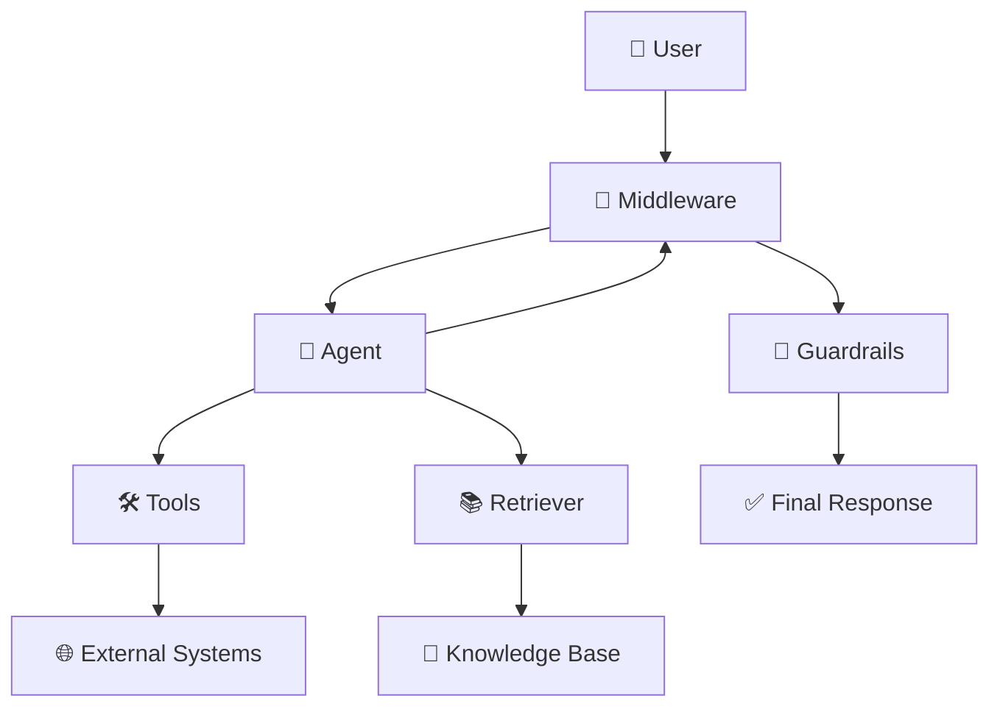
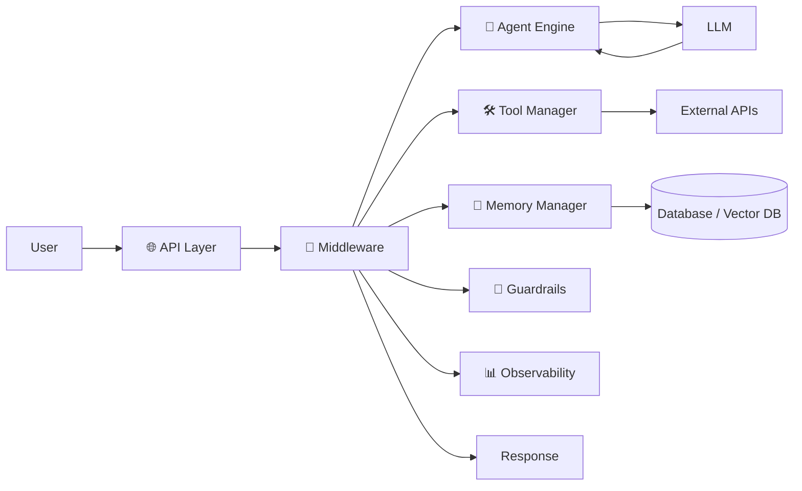

## 🧩 Agent Middleware (The “Control Layer” for AI Agents)

Agent middleware is the **orchestration layer that sits between users, LLM agents, tools, and data systems**. It ensures that everything works **reliably, safely, and efficiently**.

---

# 🧠 1. Concept in Detail

## 🔍 What is Agent Middleware?

👉 In simple terms:

> **Agent Middleware = The “traffic controller + brain support system” for AI agents**

It manages:

* 🧭 Decision flow
* 🔐 Safety & permissions
* 🔁 Execution loops
* 📊 Observability
* 🛠 Tool orchestration

---

## 🏗️ Why Do We Need It?

Without middleware:

* Agents act unpredictably ❌
* No control over tools ❌
* Hard to debug ❌
* No governance ❌

With middleware:

* Structured execution ✅
* Safe tool usage ✅
* Scalable systems ✅

---

## 🧩 Core Responsibilities

### 1. 🧭 Orchestration Engine

Controls:

* Execution flow
* Multi-step reasoning
* Task sequencing

---

### 2. 🛠 Tool Manager

* Registers tools
* Validates inputs
* Executes APIs / DB queries

---

### 3. 🔐 Guardrails & Safety Layer

* Prevents unsafe actions
* Enforces policies
* Filters inputs/outputs

---

### 4. 🧠 Memory Manager

* Short-term memory (conversation)
* Long-term memory (DB/vector store)

---

### 5. 🔁 Execution Loop Controller

* Retry logic
* Iteration limits
* Timeout handling

---

### 6. 📊 Observability & Logging

* Tracks:

  * Agent decisions
  * Tool calls
  * Errors

---

### 7. ⚡ Performance Layer

* Caching
* Rate limiting
* Cost optimization

---

## 🔄 Middleware in Action



---

## 🧠 Key Insight

👉 The **agent decides WHAT to do**
👉 The **middleware controls HOW it is done safely and reliably**

---

# ⚙️ 2. How to Implement

## 🏗️ High-Level Architecture



---

## 🧪 Step-by-Step Implementation

### Step 1: Define Agent Interface

```python
class Agent:
    def plan(self, input): ...
    def act(self, state): ...
    def reflect(self, result): ...
```

---

### Step 2: Build Middleware Core

```python
class Middleware:
    def __init__(self):
        self.tools = []
        self.memory = Memory()
    
    def handle_request(self, query):
        state = {}
        
        for _ in range(MAX_STEPS):
            action = agent.plan(query, state)
            
            if action.type == "tool":
                result = self.execute_tool(action)
            else:
                result = self.call_llm(action)
            
            state.update(result)
            
            if self.is_done(state):
                break
        
        return self.format_response(state)
```

---

### Step 3: Tool Registry

```python
tools = {
  "search": search_api,
  "db_query": query_db,
  "calculator": calc
}
```

---

### Step 4: Add Guardrails

* Input validation
* Output filtering
* Tool permission checks

---

### Step 5: Add Observability

Track:

* Execution steps
* Latency
* Failures

---

### Step 6: Add Memory

* Redis / DB for session memory
* Vector DB for long-term knowledge

---

### Step 7: Add Scaling Features

* Async execution
* Queue systems (Kafka, Pub/Sub)
* Caching

---

# 🌍 3. Real-World Scenarios

## 📊 Scenario 1: Enterprise AI Assistant

Middleware:

* 🔐 Restricts sensitive DB access
* 📊 Logs all queries
* 🛠 Controls API usage

---

## 💻 Scenario 2: Developer Agent

Middleware:

* 🧪 Sandboxes code execution
* 🔁 Limits infinite loops
* 📂 Controls file access

---

## 🏥 Scenario 3: Healthcare Assistant

Middleware:

* ⚠️ Filters unsafe medical advice
* 📚 Ensures trusted sources
* 🔐 Enforces compliance

---

## 🛍️ Scenario 4: E-commerce Agent

Middleware:

* 🛒 Validates pricing APIs
* ⚡ Caches product data
* 🔄 Handles retries for failures

---

## 🧾 Scenario 5: Financial Advisory Bot

Middleware:

* 🔐 Enforces regulatory rules
* 📊 Logs decisions for audits
* ⚠️ Adds disclaimers automatically

---

# ⚡ 4. Advantages & Requirements

## ✅ Advantages

### 🧩 Control & Reliability

* Prevents agent chaos
* Structured workflows

---

### 🔐 Safety & Governance

* Policy enforcement
* Secure tool usage

---

### 📊 Observability

* Debuggable systems
* Traceable decisions

---

### ⚡ Scalability

* Works in production systems
* Handles multiple agents

---

### 🔁 Flexibility

* Plug-and-play tools
* Supports multiple LLMs

---

## ⚠️ Requirements

### 💻 Infrastructure

* API layer
* Tool integrations
* Storage systems

---

### 🧠 Design Complexity

* Requires proper architecture
* Not trivial for beginners

---

### ⚡ Performance Tuning

* Latency control
* Cost optimization

---

### 🔐 Security Layer

* Access control
* Data protection

---

### 📊 Monitoring Stack

* Logs, traces, alerts

---

# 🔄 Agent vs Middleware (Important Distinction)

| Component     | Role               |
| ------------- | ------------------ |
| 🤖 Agent      | Decides actions    |
| 🧩 Middleware | Controls execution |
| 🛠 Tools      | Perform actions    |
| 📚 Data       | Provides knowledge |

---

# 🧠 Final Intuition

👉 Think of a **self-driving car**:

* 🚗 Agent = Driver (decision maker)
* 🧩 Middleware = Control system (brakes, safety, rules)
* 🛣 Tools = Roads, sensors, APIs

Without middleware:
👉 The driver might crash

With middleware:
👉 Safe, controlled, scalable system

---

# 🔮 When Should You Use Agent Middleware?

Use it when:

* Building **production-grade AI agents**
* Need **security & compliance**
* Using **multiple tools/APIs**
* Require **monitoring & debugging**

Avoid (or simplify) when:

* Small prototypes
* Single-step LLM apps
* No tool usage
