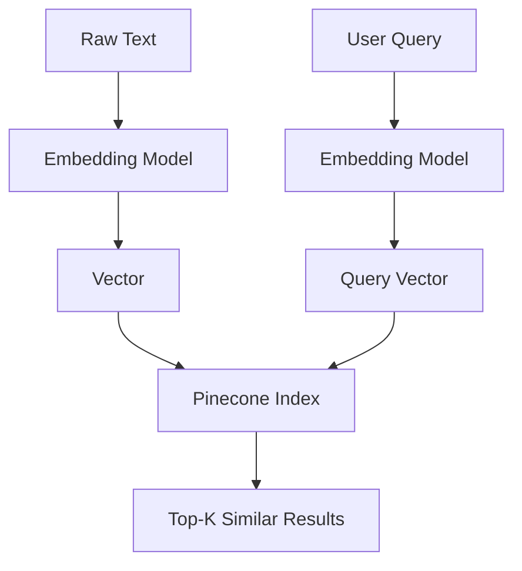
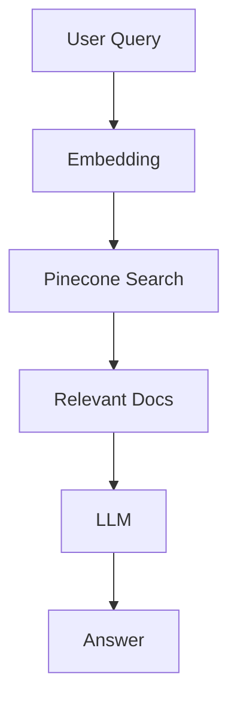
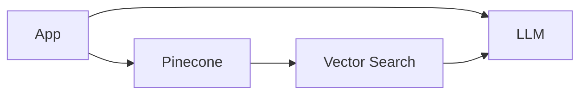

# 🌲 1. What is Pinecone Vector DB?

**Pinecone** is a **managed vector database** designed to store and search **embeddings (vectors)** efficiently.

---

## 🎯 Core Idea

Instead of keyword matching:

```text
"dog food" ≠ "pet nutrition"
```

👉 Vector search understands **meaning**:

```text
"dog food" ≈ "pet nutrition" ✅
```

---

## 🧠 What is a Vector?

A vector is a list of numbers representing meaning:

```python
[0.12, -0.98, 0.45, ...]
```

Generated using embedding models.

---

## 🔑 Key Concepts

---

### 🧬 1. Embeddings

Convert text → vector

Example:

```text
"What is AI?" → [0.23, -0.11, ...]
```

---

### 📦 2. Index

* Storage structure in Pinecone
* Holds vectors + metadata

---

### 🔍 3. Similarity Search

Find closest vectors using:

* Cosine similarity
* Dot product
* Euclidean distance

---

### 🏷️ 4. Metadata Filtering

Attach data like:

```json
{
  "source": "docs",
  "category": "AI"
}
```

---

### ⚡ 5. Top-K Search

Return top K similar results

---

### 📊 6. Namespaces

* Logical partition inside index

---

# 🔁 How Pinecone Works



---

# ⚙️ 2. How to Implement Pinecone

---

## 🧩 Step 1: Install SDK

```bash
pip install pinecone-client
```

---

## 🧩 Step 2: Initialize

```python
from pinecone import Pinecone

pc = Pinecone(api_key="YOUR_API_KEY")
```

---

## 🧩 Step 3: Create Index

```python
pc.create_index(
    name="my-index",
    dimension=1536,
    metric="cosine"
)
```

---

## 🧩 Step 4: Insert Vectors

```python
index = pc.Index("my-index")

index.upsert([
    ("id1", [0.1, 0.2, 0.3], {"text": "AI is powerful"}),
    ("id2", [0.4, 0.5, 0.6], {"text": "Machine learning"})
])
```

---

## 🧩 Step 5: Query

```python
results = index.query(
    vector=[0.1, 0.2, 0.3],
    top_k=2,
    include_metadata=True
)

print(results)
```

---

# 💻 3. Full Example (RAG Style)

```python
from openai import OpenAI
from pinecone import Pinecone

# Initialize
pc = Pinecone(api_key="YOUR_API_KEY")
index = pc.Index("my-index")

client = OpenAI()

# Step 1: Embed query
embedding = client.embeddings.create(
    model="text-embedding-3-small",
    input="What is AI?"
).data[0].embedding

# Step 2: Search
results = index.query(
    vector=embedding,
    top_k=3,
    include_metadata=True
)

# Step 3: Build context
context = "\n".join([r["metadata"]["text"] for r in results["matches"]])

# Step 4: Generate answer
response = client.chat.completions.create(
    model="gpt-4o",
    messages=[
        {"role": "system", "content": "Answer using context"},
        {"role": "user", "content": f"Context:\n{context}\n\nQuestion: What is AI?"}
    ]
)

print(response.choices[0].message.content)
```

---

# 🔁 RAG Flow with Pinecone



---

# 🧪 4. Real-world Examples

---

## 🔎 Example 1: Semantic Search

Search docs by meaning

---

## 🤖 Example 2: RAG Chatbot

* Store documents
* Retrieve context
* Generate answers

---

## 🛍️ Example 3: Product Search

* "Cheap running shoes" → relevant items

---

## 📄 Example 4: Document Q&A

* PDFs → embeddings → query

---

# 🚀 5. Advantages

---

### ⚡ Fast Similarity Search

Optimized for vectors

---

### 📈 Scalable

Handles millions/billions of vectors

---

### 🔌 Fully Managed

No infra setup

---

### 🧠 Semantic Understanding

Better than keyword search

---

### 🏷️ Metadata Filtering

Powerful querying

---

# ⚠️ 6. Requirements / Limitations

---

### 💰 Cost

* Paid service (usage-based)

---

### 🧠 Embedding Dependency

Quality depends on embedding model

---

### 📦 Vector Size Fixed

Must match index dimension

---

### 🔐 Data Privacy

Sensitive data considerations

---

# 🔄 7. Pinecone in AI Stack



---

# 🧾 Final Summary

### 🌲 Pinecone =

* 🧬 Vector storage
* 🔍 Semantic search
* ⚡ Fast retrieval
* 📦 Managed infrastructure

---

### 🧠 In One Line

👉 *Pinecone lets you search data by meaning, not just keywords*

---

## ✅ Quick Setup Checklist

1. Create Pinecone account
2. Create index
3. Generate embeddings
4. Upsert vectors
5. Query with embeddings
