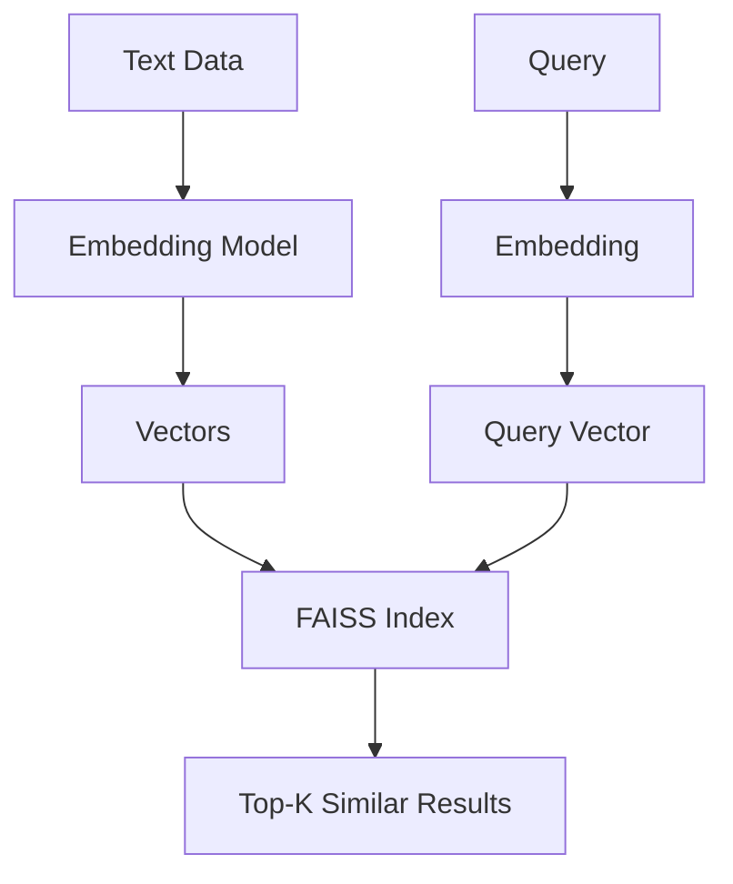
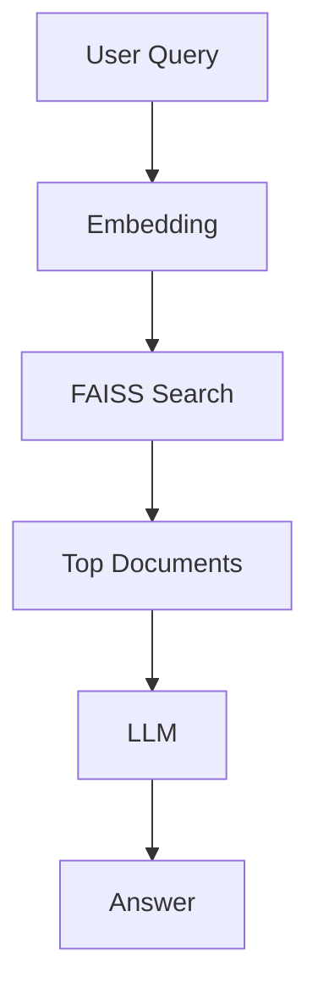

If Pinecone is the “managed cloud solution,” then FAISS is the **raw engine under the hood** — powerful, fast, but you control everything.

---

# ⚡ 1. What is FAISS (Facebook AI Similarity Search)?

**FAISS** is an **open-source library** for **efficient similarity search on vectors (embeddings)**.

Developed by Meta (Facebook AI), it is widely used for:

* 🔍 Semantic search
* 🤖 RAG pipelines
* 📊 Recommendation systems

---

## 🎯 Core Idea

Instead of searching text:

```text
"AI" ≠ "Artificial Intelligence"
```

👉 FAISS compares **vector representations**:

```python
[0.12, -0.45, 0.88] ≈ [0.11, -0.44, 0.90] ✅
```

---

## 🧠 FAISS vs Traditional DB

| Feature   | Traditional DB | FAISS           |
| --------- | -------------- | --------------- |
| Data Type | Rows           | Vectors         |
| Search    | Exact match    | Similarity      |
| Use Case  | CRUD           | Semantic search |

---

# 🔑 2. Core Concepts

---

## 🧬 1. Embeddings

Convert text → vectors

```python
"AI is cool" → [0.21, -0.33, ...]
```

---

## 📦 2. Index

Core structure for storing/searching vectors

Types:

* `IndexFlatL2` → exact search
* `IndexIVFFlat` → faster approximate
* `HNSW` → graph-based

---

## 📏 3. Distance Metrics

| Metric         | Use         |
| -------------- | ----------- |
| L2 (Euclidean) | Distance    |
| Inner Product  | Similarity  |
| Cosine         | Most common |

---

## ⚡ 4. Approximate Nearest Neighbor (ANN)

👉 Trade-off:

* Accuracy 🔽
* Speed 🔼

---

## 🧠 5. Clustering (IVF)

* Groups vectors into clusters
* Search only relevant clusters

---

## 🔁 FAISS Workflow



---

# ⚙️ 3. How to Implement FAISS

---

## 📦 Step 1: Install

```bash
pip install faiss-cpu
```

(Use `faiss-gpu` for GPU acceleration)

---

## 💻 Step 2: Create Index

```python
import faiss
import numpy as np

# Dimension of vectors
dim = 3

# Create index (L2 distance)
index = faiss.IndexFlatL2(dim)
```

---

## 📥 Step 3: Add Vectors

```python
vectors = np.array([
    [0.1, 0.2, 0.3],
    [0.4, 0.5, 0.6]
]).astype('float32')

index.add(vectors)
```

---

## 🔍 Step 4: Search

```python
query = np.array([[0.1, 0.2, 0.3]]).astype('float32')

distances, indices = index.search(query, k=2)

print(indices)
print(distances)
```

---

# 💻 4. Full Example (RAG Style)

```python
import faiss
import numpy as np
from openai import OpenAI

client = OpenAI()

# Sample documents
docs = ["AI is intelligence", "ML is a subset of AI"]

# Step 1: Embed documents
embeddings = []
for d in docs:
    emb = client.embeddings.create(
        model="text-embedding-3-small",
        input=d
    ).data[0].embedding
    embeddings.append(emb)

embeddings = np.array(embeddings).astype('float32')

# Step 2: Create FAISS index
dim = len(embeddings[0])
index = faiss.IndexFlatL2(dim)
index.add(embeddings)

# Step 3: Query
query = "What is AI?"
q_emb = client.embeddings.create(
    model="text-embedding-3-small",
    input=query
).data[0].embedding

q_emb = np.array([q_emb]).astype('float32')

distances, indices = index.search(q_emb, k=2)

# Step 4: Retrieve context
context = "\n".join([docs[i] for i in indices[0]])

# Step 5: Generate answer
response = client.chat.completions.create(
    model="gpt-4o",
    messages=[
        {"role": "system", "content": "Answer using context"},
        {"role": "user", "content": f"{context}\n\n{query}"}
    ]
)

print(response.choices[0].message.content)
```

---

# 🔁 RAG Flow with FAISS



---

# 🧪 5. Real-world Examples

---

## 🔎 Example 1: Semantic Search

* Search docs by meaning

---

## 🤖 Example 2: Chatbot (RAG)

* Retrieve context from FAISS
* Generate answer using LLM

---

## 🛍️ Example 3: Recommendation System

* Similar products/users

---

## 📄 Example 4: Document Search

* PDFs → embeddings → search

---

# 🚀 6. Advantages

---

### ⚡ Extremely Fast

Optimized for large-scale vector search

---

### 🆓 Open Source

No vendor lock-in

---

### 🧠 Flexible

Multiple index types

---

### 🖥️ Runs Locally

No cloud dependency

---

### 🚀 GPU Support

Massive speed boost

---

# ⚠️ 7. Requirements / Limitations

---

### ❌ No Built-in API

You must build your own service

---

### ❌ No Persistence by Default

Need to save/load index manually

```python
faiss.write_index(index, "index.faiss")
index = faiss.read_index("index.faiss")
```

---

### ❌ No Metadata Filtering

Unlike Pinecone

---

### 🧠 Setup Complexity

More control = more responsibility

---

# 🔄 8. FAISS vs Pinecone

| Feature  | FAISS   | Pinecone   |
| -------- | ------- | ---------- |
| Type     | Library | Managed DB |
| Setup    | Manual  | Easy       |
| Scaling  | Manual  | Automatic  |
| Cost     | Free    | Paid       |
| Metadata | ❌       | ✅          |

---

# 🔄 9. FAISS in AI Stack


---

# 🧾 Final Summary

### ⚡ FAISS =

* 🧬 Vector similarity engine
* ⚡ High-performance search
* 🆓 Open-source
* 🖥️ Local execution

---

### 🧠 In One Line

👉 *FAISS is the fastest way to search vectors when you want full control*

---

## ✅ Quick Setup Checklist

1. Install FAISS
2. Generate embeddings
3. Create index
4. Add vectors
5. Query
