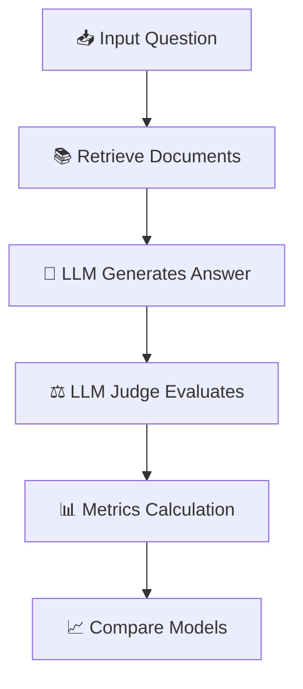
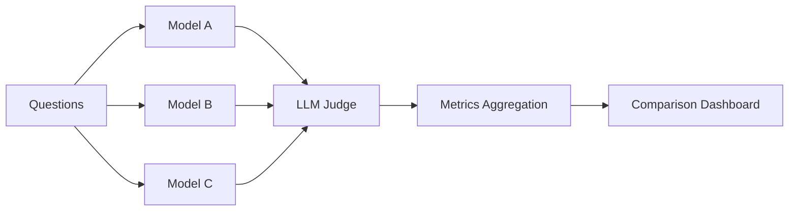
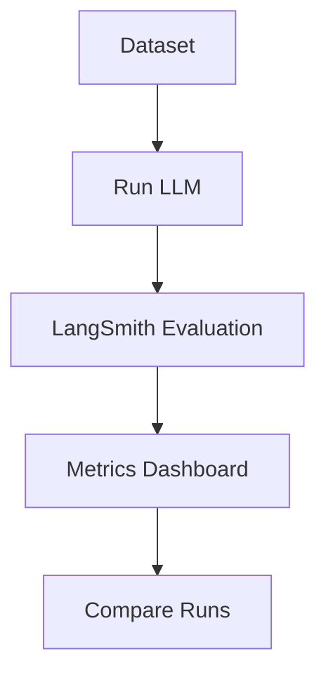
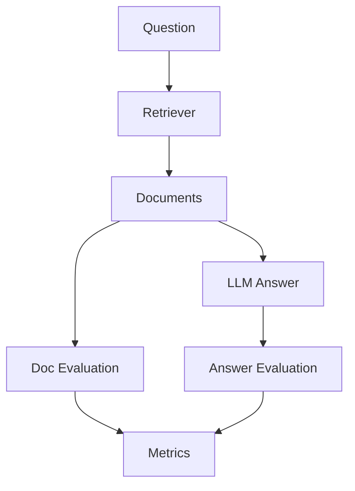

# 🧠 1. What is LLM Evaluation?

LLM evaluation is the process of **measuring how well a language model performs on a specific task** using defined metrics and datasets.

### 🎯 Goal

Pick the **best model for your use case**, not the “most popular” one.

---

## 🔑 Core Concepts

### 📊 1. Dataset (Evaluation Set)

* A collection of:

  * Questions (inputs)
  * Ground truth answers (optional but ideal)
  * Context documents (for RAG)

---

### ⚖️ 2. LLM as a Judge

Instead of humans manually evaluating, another LLM evaluates outputs.

Example:

* Input: Question + Answer
* Judge LLM decides:

  * ✔️ Relevant?
  * ✔️ Correct?
  * ✔️ Grounded?

---

### 📏 3. Evaluation Metrics

You already listed the most important ones — let’s formalize them:

| Metric                | Meaning                                      |
| --------------------- | -------------------------------------------- |
| 📄 Document Relevance | Are retrieved docs relevant to the question? |
| 🎯 Answer Relevance   | Does answer address the question?            |
| 🔗 Groundedness       | Is answer supported by documents?            |
| ✅ Correctness         | Does it match ground truth?                  |

---

### 🧪 4. Model Comparison

You run **same dataset across multiple models** and compare scores.

---

## 🔁 End-to-End Flow



---

# ⚙️ 2. How to Implement LLM Evaluation

## 🧩 Step-by-step Pipeline

### Step 1: Gather Data 🗂️

* Real user queries (best)
* Synthetic queries (fallback)
* Ground truth answers (optional but powerful)

---

### Step 2: Generate Outputs 🤖

Run queries on:

* Model A (e.g., GPT)
* Model B (e.g., Claude)
* Model C (open-source)

---

### Step 3: Evaluate using LLM as Judge ⚖️

Prompt example:

```text
You are an evaluator.

Question: {question}
Answer: {answer}
Context: {documents}

Evaluate:
1. Is the answer relevant? (yes/no)
2. Is it grounded in the context? (yes/no)
3. Is it correct? (score 1-5)

Return JSON.
```

---

### Step 4: Compute Metrics 📊

Aggregate scores:

* Accuracy %
* Average score
* Pass/fail rates

---

### Step 5: Compare Models 🆚

| Model  | Relevance | Groundedness | Accuracy |
| ------ | --------- | ------------ | -------- |
| GPT-4  | 92%       | 89%          | 91%      |
| Claude | 90%       | 93%          | 89%      |
| LLaMA  | 82%       | 80%          | 78%      |

---

## 🧠 Evaluation Architecture



---

# 💻 3. Sample Code (Python)

Here’s a simplified evaluation pipeline:

```python
from openai import OpenAI
client = OpenAI()

def generate_answer(model, question, context):
    response = client.chat.completions.create(
        model=model,
        messages=[
            {"role": "system", "content": "Answer using context only"},
            {"role": "user", "content": f"Context: {context}\nQuestion: {question}"}
        ]
    )
    return response.choices[0].message.content


def judge_answer(question, answer, context):
    prompt = f"""
    Evaluate the answer.

    Question: {question}
    Answer: {answer}
    Context: {context}

    Return JSON:
    {{
      "relevance": true/false,
      "grounded": true/false,
      "score": 1-5
    }}
    """

    response = client.chat.completions.create(
        model="gpt-4o-mini",
        messages=[{"role": "user", "content": prompt}]
    )

    return response.choices[0].message.content


# Example run
question = "What is RAG?"
context = "RAG combines retrieval with generation..."
models = ["gpt-4o", "gpt-4o-mini"]

results = []

for model in models:
    answer = generate_answer(model, question, context)
    evaluation = judge_answer(question, answer, context)

    results.append({
        "model": model,
        "answer": answer,
        "evaluation": evaluation
    })

print(results)
```

---

# 📌 4. Examples

## ✅ Example 1: Good Answer

* Question: “What is RAG?”
* Answer explains retrieval + generation
* Uses context
* ✔️ Relevant
* ✔️ Grounded
* ✔️ Correct

---

## ❌ Example 2: Hallucinated Answer

* Mentions concepts not in context
* ❌ Not grounded

---

## ❌ Example 3: Irrelevant Answer

* Talks about LLM training instead of RAG
* ❌ Not relevant

---

# 🚀 5. Advantages

### 🎯 Objective Decision Making

No guessing which model is better

### 🔁 Repeatability

Same dataset → same evaluation

### ⚡ Faster Iteration

Test prompt changes quickly

### 📊 Quantifiable Results

Compare models with numbers

---

# ⚠️ 6. Requirements

### 📦 Data

* Real user queries preferred

### 🧠 Good Judge Prompt

Bad prompt → unreliable evaluation

### 💰 Cost Consideration

* LLM-as-judge costs tokens

### 🧪 Validation

* Occasionally validate with humans

---

# 🧰 7. Using LangSmith

LangSmith is purpose-built for LLM evaluation and debugging.

---

## 🔧 What LangSmith Provides

### 📊 Dataset Management

* Store evaluation datasets
* Version them

### ⚖️ Built-in Evaluators

* Relevance
* Correctness
* Custom metrics

---

## 🔁 LangSmith Workflow



---

## 💻 Example (LangSmith-style)

```python
from langsmith import Client

client = Client()

dataset = client.create_dataset("rag-eval")

client.create_example(
    dataset_id=dataset.id,
    inputs={"question": "What is RAG?"},
    outputs={"answer": "Retrieval augmented generation..."}
)

def evaluator(run, example):
    return {
        "score": 1 if "retrieval" in run.outputs["answer"] else 0
    }

client.run_on_dataset(
    dataset_name="rag-eval",
    llm_or_chain=my_chain,
    evaluation=evaluator
)
```

---

## 🧠 Why LangSmith Helps

* 🔍 Trace every LLM call
* 📈 Compare experiments
* 🧪 Plug-and-play evaluators
* 🧾 Debug failures easily

---
Here are **practical, ready-to-use code snippets** for LLM evaluation — from simple scripts to structured pipelines (including RAG + metrics + LangSmith).

---

# 🧪 1. Minimal LLM Evaluation (Core Idea)

This is the **simplest working version**:
👉 Generate answer → Judge it → Store result

```python
from openai import OpenAI
import json

client = OpenAI()

def generate_answer(model, question, context):
    response = client.chat.completions.create(
        model=model,
        messages=[
            {"role": "system", "content": "Answer ONLY using provided context."},
            {"role": "user", "content": f"Context:\n{context}\n\nQuestion:\n{question}"}
        ],
        temperature=0
    )
    return response.choices[0].message.content


def judge_answer(question, answer, context, ground_truth=None):
    prompt = f"""
    You are an evaluator.

    Question: {question}
    Answer: {answer}
    Context: {context}
    Ground Truth: {ground_truth}

    Evaluate:
    1. Is the answer relevant to the question? (true/false)
    2. Is the answer grounded in the context? (true/false)
    3. Does it match ground truth? (score 1-5)

    Return JSON:
    {{
        "relevance": true/false,
        "grounded": true/false,
        "correctness": 1-5
    }}
    """

    response = client.chat.completions.create(
        model="gpt-4o-mini",
        messages=[{"role": "user", "content": prompt}],
        temperature=0
    )

    return json.loads(response.choices[0].message.content)


# Example
question = "What is RAG?"
context = "RAG combines retrieval with generation."
ground_truth = "RAG is retrieval augmented generation."

answer = generate_answer("gpt-4o", question, context)
evaluation = judge_answer(question, answer, context, ground_truth)

print("Answer:", answer)
print("Evaluation:", evaluation)
```

---

# 📊 2. Batch Evaluation (Multiple Questions + Models)

👉 This is what you actually use in real projects

```python
dataset = [
    {
        "question": "What is RAG?",
        "context": "RAG combines retrieval and generation.",
        "ground_truth": "Retrieval augmented generation"
    },
    {
        "question": "What is an LLM?",
        "context": "LLMs are large language models trained on text.",
        "ground_truth": "Large language model"
    }
]

models = ["gpt-4o", "gpt-4o-mini"]

results = []

for item in dataset:
    for model in models:
        answer = generate_answer(model, item["question"], item["context"])
        eval_result = judge_answer(
            item["question"],
            answer,
            item["context"],
            item["ground_truth"]
        )

        results.append({
            "model": model,
            "question": item["question"],
            "evaluation": eval_result
        })

print(results)
```

---

# 📈 3. Metric Aggregation (Scoring)

👉 Convert raw evaluations into **decision-making metrics**

```python
from collections import defaultdict

metrics = defaultdict(lambda: {
    "relevance": 0,
    "grounded": 0,
    "correctness": 0,
    "count": 0
})

for r in results:
    m = metrics[r["model"]]
    eval_data = r["evaluation"]

    m["relevance"] += int(eval_data["relevance"])
    m["grounded"] += int(eval_data["grounded"])
    m["correctness"] += eval_data["correctness"]
    m["count"] += 1

# Compute averages
for model, m in metrics.items():
    print(f"\nModel: {model}")
    print("Relevance:", m["relevance"] / m["count"])
    print("Grounded:", m["grounded"] / m["count"])
    print("Correctness:", m["correctness"] / m["count"])
```

---

# 🔎 4. RAG Evaluation (Retrieval + Generation)

👉 Adds **document relevance evaluation**

```python
def judge_retrieval(question, documents):
    prompt = f"""
    Evaluate document relevance.

    Question: {question}
    Documents: {documents}

    Return JSON:
    {{
        "relevant_docs": 0-100 percentage
    }}
    """

    response = client.chat.completions.create(
        model="gpt-4o-mini",
        messages=[{"role": "user", "content": prompt}]
    )

    return json.loads(response.choices[0].message.content)
```

---

# 🔁 RAG Evaluation Flow



---

# ⚖️ 5. Pairwise Model Comparison (Better Than Raw Scores)

👉 Directly compare models using LLM judge

```python
def compare_answers(question, answer_a, answer_b):
    prompt = f"""
    Compare two answers.

    Question: {question}

    Answer A: {answer_a}
    Answer B: {answer_b}

    Which is better? (A/B/Tie)
    Explain briefly.

    Return JSON:
    {{
        "winner": "A/B/Tie"
    }}
    """

    response = client.chat.completions.create(
        model="gpt-4o-mini",
        messages=[{"role": "user", "content": prompt}]
    )

    return json.loads(response.choices[0].message.content)
```

---

# 🧰 6. Using LangSmith

👉 This is how you **productionize evaluation**

---

## 📦 Setup

```bash
pip install langsmith
export LANGCHAIN_API_KEY="your_key"
```

---

## 🧪 Create Dataset

```python
from langsmith import Client

client = Client()

dataset = client.create_dataset("llm-eval-demo")

client.create_example(
    dataset_id=dataset.id,
    inputs={"question": "What is RAG?"},
    outputs={"answer": "Retrieval augmented generation"}
)
```

---

## ⚙️ Run Evaluation

```python
def simple_chain(inputs):
    return {
        "answer": generate_answer(
            "gpt-4o",
            inputs["question"],
            "RAG combines retrieval and generation"
        )
    }

def evaluator(run, example):
    return {
        "score": 1 if "retrieval" in run.outputs["answer"].lower() else 0
    }

client.run_on_dataset(
    dataset_name="llm-eval-demo",
    llm_or_chain=simple_chain,
    evaluation=evaluator
)
```

---

## 📊 Built-in LLM Evaluator (LangSmith style)

```python
from langchain.evaluation import load_evaluator

evaluator = load_evaluator("qa")

result = evaluator.evaluate_strings(
    prediction="RAG combines retrieval and generation",
    reference="Retrieval augmented generation",
    input="What is RAG?"
)

print(result)
```

---

# 🧠 7. Production Tips (Important)

### ⚠️ Avoid these mistakes:

* ❌ Using vague judge prompts
* ❌ No ground truth when available
* ❌ Evaluating on synthetic-only data

---

### ✅ Best Practices:

* Use **multiple metrics together**
* Combine:

  * LLM judge + rule-based checks
* Keep:

  * Separate **dev vs eval datasets**
* Periodically:

  * **Human validate samples**

---

# 🧾 Final Takeaway

👉 A solid LLM evaluation system has:

* 📥 Dataset (questions + context + ground truth)
* 🤖 Multiple models
* ⚖️ LLM-as-judge
* 📊 Metrics aggregation
* 🆚 Model comparison
