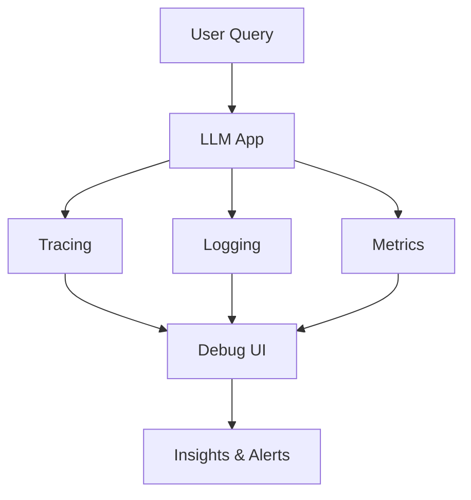
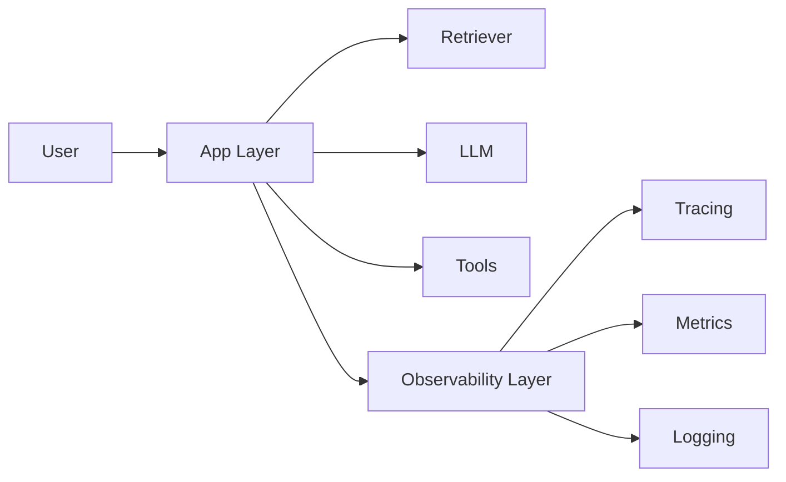
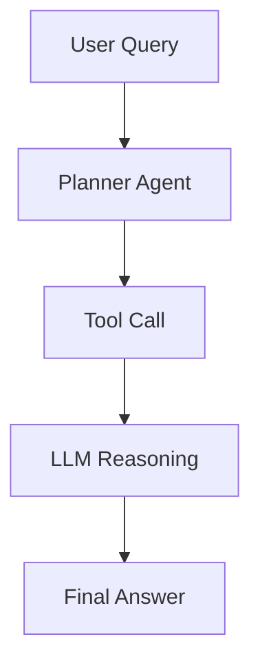
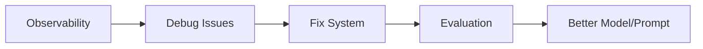

LLM observability is where most teams either **gain control of their AI systems—or completely lose visibility**. If evaluation tells you *which model is better*, observability tells you *what is actually happening in production*.

---

# 👁️ 1. What is LLM Observability?

LLM observability is the practice of **tracking, debugging, monitoring, and understanding the behavior of LLM applications in real time**.

### 🎯 Goal

Answer questions like:

* ❓ Why did the model give this answer?
* ❓ Which step failed (retrieval, prompt, tool)?
* ❓ Why is latency high?
* ❓ Why are hallucinations increasing?

---

## 🔑 Core Concepts

### 🧬 1. Tracing (Most Important)

Track **every step in your LLM pipeline**

Example trace:

```
User Query → Retriever → Documents → Prompt → LLM → Output
```

Each step is logged with:

* Inputs
* Outputs
* Latency
* Errors

---

### 📊 2. Metrics

| Metric        | Meaning       |
| ------------- | ------------- |
| ⏱️ Latency    | Response time |
| 💰 Cost       | Tokens used   |
| ❌ Error Rate  | Failures      |
| 🎯 Quality    | Eval scores   |
| 🔄 Throughput | Requests/sec  |

---

### 🧾 3. Logging

Store:

* Prompts
* Responses
* Retrieved docs
* Tool calls

---

### 🔍 4. Debugging

Ability to:

* Replay a request
* Inspect intermediate steps
* Modify prompt and re-run

---

### 🚨 5. Monitoring & Alerts

* Detect spikes in errors
* Detect drop in quality
* Notify when system degrades

---

## 🔁 Observability Flow



---

# ⚙️ 2. How to Implement LLM Observability

## 🧩 Architecture



---

## 🛠️ Basic Implementation (Manual Logging)

```python id="j41lm5"
import time

def observable_llm_call(question, context):
    start = time.time()

    print("📥 Input:", question)

    # Simulate LLM call
    answer = f"Answer based on {context}"

    latency = time.time() - start

    log = {
        "question": question,
        "context": context,
        "answer": answer,
        "latency": latency
    }

    print("📤 Output:", answer)
    print("⏱️ Latency:", latency)

    return log
```

---

# 🧠 3. Using LangSmith

👉 This is the **industry standard for LLM observability + evaluation**

---

## 🔍 What LangSmith gives you

### 🧬 Traces

* Full pipeline visualization
* Step-by-step execution

### 🔎 Debugging

* Inspect prompts
* Inspect outputs
* Replay runs

### 📊 Metrics

* Latency
* Token usage
* Errors

---

## 💻 LangSmith Example

```python id="4pk0qg"
from langsmith import Client
from openai import OpenAI

client = Client()
llm = OpenAI()

def my_chain(inputs):
    response = llm.chat.completions.create(
        model="gpt-4o",
        messages=[
            {"role": "user", "content": inputs["question"]}
        ]
    )
    return {"answer": response.choices[0].message.content}

client.run_on_dataset(
    dataset_name="my-dataset",
    llm_or_chain=my_chain
)
```

👉 This automatically:

* Captures traces
* Logs inputs/outputs
* Tracks performance

---

# 🔗 4. Using LangGraph Studio

👉 Best for **agent workflows (multi-step reasoning systems)**

---

## 🧠 What LangGraph Studio provides

### 🔄 State Visualization

* Shows how data flows between nodes

### 🧭 Step Execution

* See each agent decision

### 🧪 Interactive Debugging

* Pause, edit, re-run nodes

---

## 🧩 Example Agent Flow



👉 In LangGraph Studio, you can:

* Click each node
* See inputs/outputs
* Modify behavior live

---

# 📌 5. Real-world Examples

## 🧪 Example 1: RAG Failure Debugging

Problem:

* Wrong answer

Observability shows:

* ❌ Retriever returned irrelevant docs

---

## 🧪 Example 2: High Latency

Trace shows:

* Retriever = 200ms
* LLM = 4s ❗

👉 Optimize model or prompt

---

## 🧪 Example 3: Hallucination

Logs show:

* Answer not in retrieved docs

👉 Fix:

* Prompt → “Use only context”

---

# 🚀 6. Advantages

### 🔍 Full Visibility

Know exactly what happened

### ⚡ Faster Debugging

Pinpoint failure instantly

### 📈 Performance Monitoring

Track latency, cost, quality

### 🔁 Continuous Improvement

Improve prompts, retrievers, models

---

# ⚠️ 7. Requirements

### 📦 Structured Logging

You must log:

* Inputs
* Outputs
* Intermediate steps

---

### 🧠 Instrumentation

Wrap your:

* LLM calls
* Retrieval
* Tools

---

### 💰 Cost Awareness

Observability adds:

* Storage cost
* Logging overhead

---

### 🔐 Privacy Considerations

* Mask sensitive data before logging

---

# 🔄 8. Observability + Evaluation Together

👉 These two MUST work together



---

# 💡 Final Summary

### 🧠 LLM Observability =

* 🧬 Tracing (step-by-step execution)
* 📊 Metrics (latency, cost, errors)
* 🧾 Logging (inputs/outputs)
* 🔍 Debugging (replay + inspect)
* 🚨 Monitoring (alerts)

---

### 🛠️ Tools

* LangSmith → tracing + metrics + evaluation
* LangGraph Studio → agent debugging
