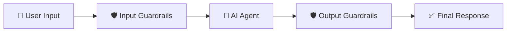
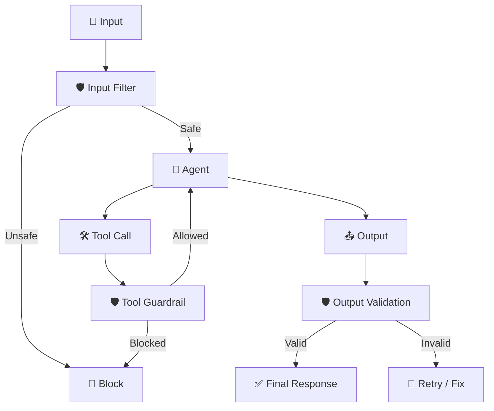

## 🛡️ AI Guardrails (Safety Layer for AI Systems)

AI Guardrails are **protective mechanisms** that ensure AI systems behave **safely, securely, and responsibly**.

---

# 🧠 1. Concept in Detail

## 🔍 What are AI Guardrails?

👉 Simple definition:

> **Guardrails = Rules + Filters + Controls that manage what goes INTO and comes OUT of an AI system**

---

## 🧩 Where Guardrails Sit

They wrap around the AI pipeline:



---

## 🎯 What Guardrails Ensure

* ✅ Safe inputs
* ✅ Approved actions
* ✅ Valid outputs
* 🔐 Compliance (PII, legal, policies)

---

## 🧠 Types of Guardrails

---

### 1. ⚙️ Deterministic Guardrails

👉 Rule-based (hard-coded logic)

Examples:

* Regex for emails 📧
* Keyword blocking 🚫
* Schema validation

✔️ Fast
❌ Limited intelligence

---

### 2. 🧠 Model-Based Guardrails

👉 Use LLMs or classifiers

Examples:

* Toxicity detection
* PII detection
* Hallucination checks

✔️ Flexible
❌ Higher latency

---

## 🧩 Guardrail Layers

---

### 🛡️ 1. Input Guardrails

* Validate user input
* Detect:

  * PII
  * harmful content

---

### 🛠️ 2. Tool Guardrails

* Control:

  * API access
  * DB queries
  * Permissions

---

### 📤 3. Output Guardrails

* Validate response
* Remove:

  * PII
  * unsafe content

---

### 🔁 4. Execution Guardrails

* Limit:

  * retries
  * loops
  * cost

---

---

## 🔄 Full Guardrail Flow



---

# ⚙️ 2. How to Implement

## 🏗️ Middleware-Based Approach (Your Context)

👉 Guardrails are often implemented as **middleware around agents**

---

## 🧩 Key Middleware Types

### 🔒 1. PII Middleware

* Masks sensitive data

Example:

```plaintext id="z6cm7h"
Input: john@gmail.com
Output: [REDACTED_EMAIL]
```

---

### 👤 2. Human-in-the-Loop Middleware

* Pauses execution
* Requires approval

---

### ⛔ 3. Before-Agent Hook

* Blocks request before agent runs

---

### ✅ 4. After-Agent Hook

* Validates final output

---

### 🧱 5. Layered Guardrails

* Combine multiple checks

---

## 🧪 Example Implementation

```python id="nmk5o4"
def input_guardrail(query):
    if contains_pii(query):
        return mask(query)
    return query

def output_guardrail(response):
    if unsafe(response):
        return "Response blocked"
    return response
```

---

## 🔐 Strategies (From Your Notes)

* 🧹 Mask → `john@gmail.com → j***@gmail.com`
* 🔒 Hash → irreversible encoding
* 🚫 Block → reject request
* 🏷 Replace → `[REDACTED_EMAIL]`

---

# 🌍 3. Real-World Scenarios

## 💬 Scenario 1: Customer Support Bot

* Input:

  * Detect credit card info 💳
* Output:

  * Prevent leaking user data

---

## 🏥 Scenario 2: Healthcare Assistant

* Block:

  * Unsafe medical advice ⚠️
* Validate:

  * Responses against guidelines

---

## 💻 Scenario 3: Developer Agent

* Restrict:

  * File system access 📂
* Prevent:

  * harmful code execution

---

## 🏢 Scenario 4: Enterprise AI

* Mask:

  * Internal company data
* Audit:

  * All responses

---

## 🛍️ Scenario 5: E-commerce Bot

* Prevent:

  * pricing manipulation
* Validate:

  * product info

---

# ⚡ 4. Advantages & Requirements

## ✅ Advantages

### 🔐 Security

* Protects sensitive data

---

### ⚖️ Compliance

* GDPR, HIPAA, etc.

---

### 🧠 Reliability

* Reduces hallucinations

---

### 🛡️ Safety

* Prevents harmful outputs

---

### 📊 Control

* Enforces system rules

---

## ⚠️ Requirements

### ⚙️ Middleware Layer

* To integrate guardrails

---

### 🧠 Detection Models

* For:

  * PII
  * toxicity
  * risk

---

### 📊 Monitoring

* Logs & alerts

---

### ⚡ Performance Optimization

* Avoid latency spikes

---

### 🔐 Policy Design

* Define what is allowed

---

# ⚠️ Limitations

* ❌ False positives (blocking valid input)
* ❌ Added latency
* ❌ Complex setup
* ❌ Needs constant tuning

---

# 🧠 Deterministic vs Model-Based

| Feature     | ⚙️ Deterministic | 🧠 Model-Based |
| ----------- | ---------------- | -------------- |
| Speed       | ⚡ Fast           | 🐢 Slower      |
| Flexibility | Low              | High           |
| Accuracy    | Rule-limited     | Context-aware  |
| Maintenance | Easy             | Complex        |

---

# 🧠 Final Intuition

👉 Think of AI Guardrails like **airport security ✈️**

* 🧍 Input = passengers
* 🛡️ Guardrails = security checks
* 🚫 Dangerous items blocked
* ✅ Safe passengers allowed

---

# 🔮 When Should You Use Guardrails?

## ✅ Always use when:

* Handling user data
* Production AI systems
* External APIs/tools

---

## 🔥 Critical for:

* Finance 💰
* Healthcare 🏥
* Enterprise apps 🏢

---

# 🏁 Final Thought

> **Without guardrails, AI is powerful but risky.
> With guardrails, AI becomes safe, reliable, and production-ready 🛡️**
