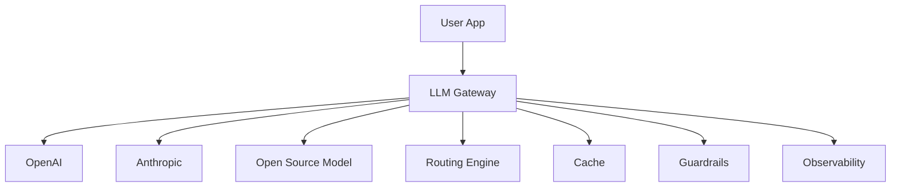
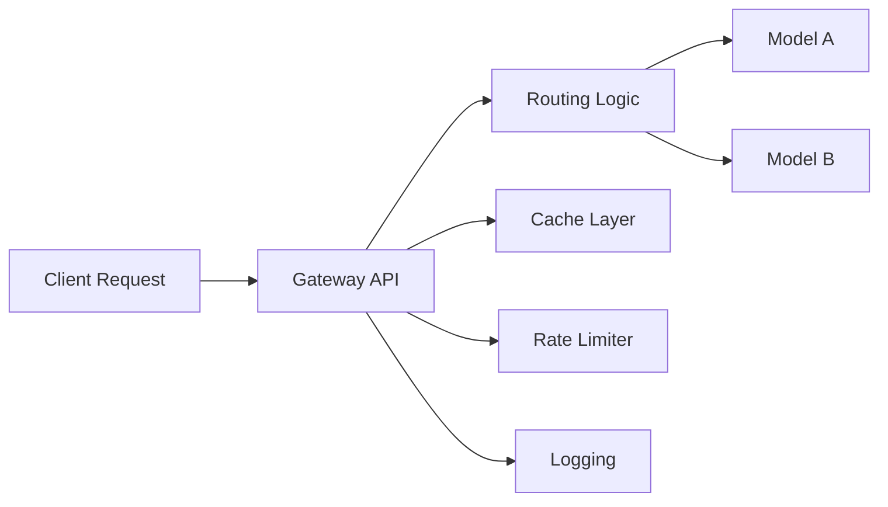
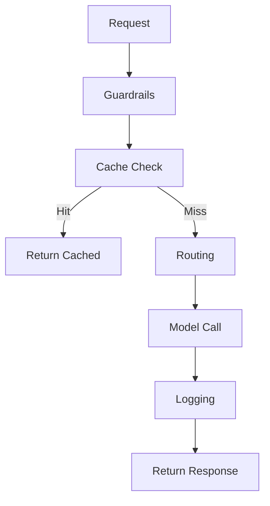
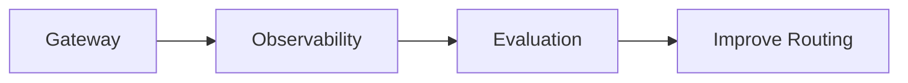

If you’re building anything beyond a toy LLM app, calling models directly is a mistake. You’ll quickly run into issues with cost, reliability, and control.

👉 That’s exactly why **LLM Gateways** exist.

---

# 🚪 1. What is an LLM Gateway?

An **LLM Gateway** is a **smart middleware layer** that sits between your application and multiple LLM providers.

### 🎯 Core Idea

Instead of:

```text
App → OpenAI
```

You do:

```text
App → Gateway → (OpenAI / Anthropic / OSS models)
```

---

## 🧠 Why it’s called “Smart Middleware”

Because it doesn’t just forward requests — it **makes decisions**:

* 🧭 Which model to use?
* 🔁 What if a model fails?
* 💰 How to minimize cost?
* 🚨 Is the output safe?
* ⚡ How to optimize latency?

---

## 🔑 Core Capabilities

### 🧭 1. Routing

Choose model dynamically:

* Cheap model for simple queries
* Powerful model for complex queries

---

### 🔁 2. Fallbacks

If one model fails:

```text
GPT-4 → fails → fallback → GPT-3.5
```

---

### ⚡ 3. Caching

Avoid repeated calls:

* Same prompt → return cached response

---

### 🚦 4. Rate Limiting

Prevent overload:

* Limit requests per user/API key

---

### 🛡️ 5. Guardrails

* Block unsafe inputs/outputs
* Enforce policies

---

### 💰 6. Cost Tracking

Track:

* Tokens used
* Cost per request
* Cost per user

---

### ⚖️ 7. Load Balancing

Distribute traffic across:

* Multiple providers
* Multiple regions

---

### 👁️ 8. Observability (Logging)

* Logs inputs/outputs
* Tracks latency/errors

---

### 🧪 9. Built-in Evaluation

* Score outputs
* Compare models

---

## 🔁 Gateway Architecture



---

# ⚙️ 2. How to Implement an LLM Gateway

## 🧩 Basic Design



---

## 💻 Simple Gateway (Python)

```python id="k1xg2n"
from openai import OpenAI
import random

client = OpenAI()

def route_model(prompt):
    # Simple routing logic
    if len(prompt) < 50:
        return "gpt-4o-mini"
    return "gpt-4o"


def call_model(model, prompt):
    response = client.chat.completions.create(
        model=model,
        messages=[{"role": "user", "content": prompt}]
    )
    return response.choices[0].message.content


def gateway(prompt):
    model = route_model(prompt)

    try:
        return call_model(model, prompt)
    except Exception:
        print("⚠️ Fallback triggered")
        return call_model("gpt-4o-mini", prompt)


# Usage
print(gateway("Explain LLMs"))
```

---

# ⚡ 3. Add Caching

```python id="r8p7yk"
cache = {}

def cached_gateway(prompt):
    if prompt in cache:
        print("⚡ Cache hit")
        return cache[prompt]

    response = gateway(prompt)
    cache[prompt] = response
    return response
```

---

# 🚦 4. Rate Limiting

```python id="0e8q9d"
import time

last_called = {}

def rate_limited_gateway(user_id, prompt):
    now = time.time()

    if user_id in last_called and now - last_called[user_id] < 1:
        raise Exception("Rate limit exceeded")

    last_called[user_id] = now
    return gateway(prompt)
```

---

# 🛡️ 5. Guardrails Example

```python id="v7r4hz"
def guardrails(prompt):
    banned_words = ["hack", "illegal"]

    for word in banned_words:
        if word in prompt.lower():
            raise Exception("❌ Unsafe input detected")

    return prompt
```

---

# 🔁 6. Full Flow



---

# 🧪 7. Real-world Examples

## 🔹 LiteLLM

* Unified API for multiple LLMs
* Drop-in replacement for OpenAI SDK
* Built-in routing + fallback

---

## 🔹 TrueFoundry Gateway

* Enterprise-grade gateway
* Cost tracking + monitoring
* Security + governance

---

# 💻 Example (LiteLLM-style Usage)

```python id="o6f3bn"
import litellm

response = litellm.completion(
    model="gpt-4o",
    messages=[{"role": "user", "content": "Hello"}]
)

print(response)
```

👉 Behind the scenes:

* Can route across providers
* Add fallback automatically

---

# 🚀 8. Advantages

### 🎯 Flexibility

Switch models without changing app code

---

### 💰 Cost Optimization

Route cheaper models when possible

---

### 🔁 Reliability

Fallback prevents downtime

---

### 🔍 Observability

Track everything centrally

---

### 🛡️ Safety

Enforce guardrails consistently

---

# ⚠️ 9. Requirements

### 🧠 Smart Routing Logic

* Based on:

  * Prompt complexity
  * Cost
  * latency

---

### 📦 Infrastructure

* API layer
* Cache (Redis)
* Logging system

---

### 🔐 Security

* API key management
* Access control

---

### 📊 Monitoring

* Track usage and failures

---

# 🔄 10. Gateway + Evaluation + Observability

👉 These three together form a **production AI stack**



---

# 🧾 Final Summary

### 🚪 LLM Gateway = Smart Middleware

It provides:

* 🧭 Routing
* 🔁 Fallbacks
* ⚡ Caching
* 🚦 Rate limiting
* 🛡️ Guardrails
* 💰 Cost tracking
* ⚖️ Load balancing
* 👁️ Observability
* 🧪 Evaluation

---

### 🧠 In One Line

👉 *LLM Gateway = Brain + Traffic Controller for all your model calls*
