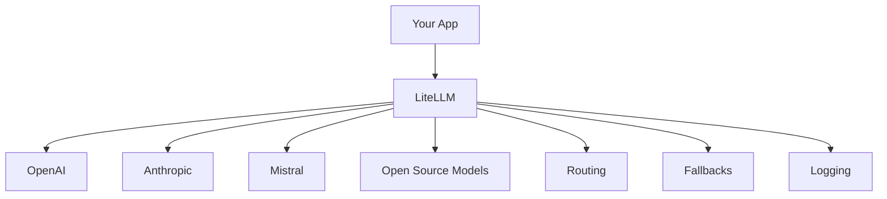
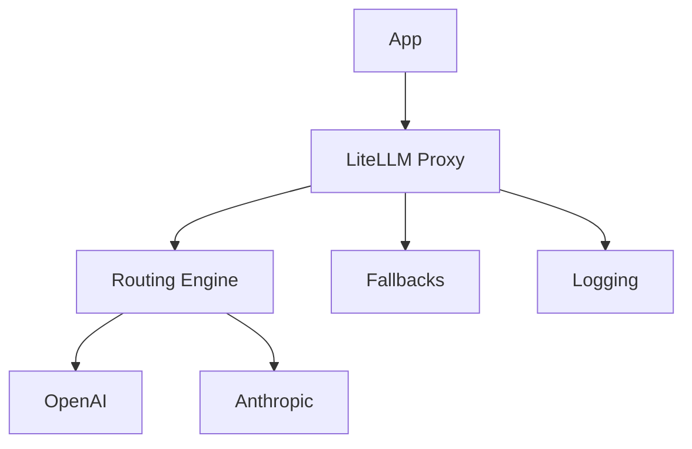
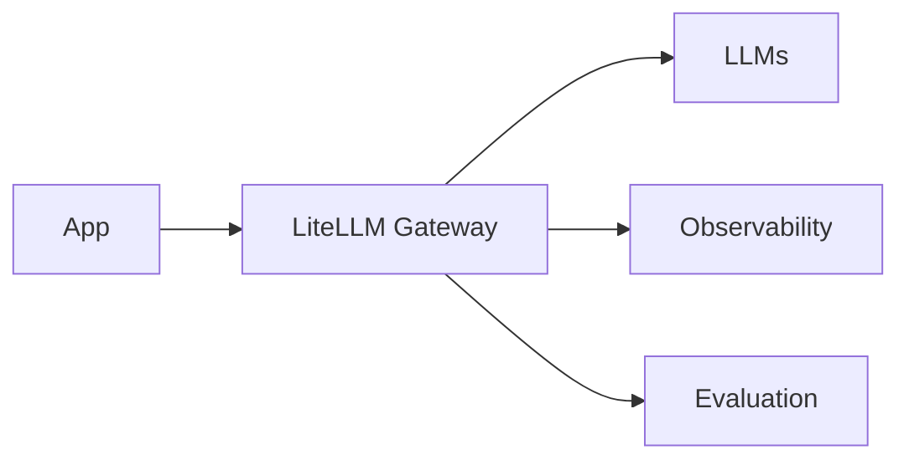

If you’re juggling multiple LLM providers, different APIs, and constantly changing models, doing it manually becomes messy fast.

👉 That’s exactly the problem **LiteLLM** solves.

---

# ⚡ 1. What is LiteLLM?

**LiteLLM** is a **unified LLM SDK + gateway** that lets you call **100+ LLMs using a single OpenAI-compatible interface**.

---

## 🎯 Core Idea

Instead of writing different code for each provider:

```python
# ❌ Without LiteLLM
openai.ChatCompletion.create(...)
anthropic.messages.create(...)
cohere.generate(...)
```

👉 You write:

```python
# ✅ With LiteLLM
litellm.completion(model="gpt-4o", ...)
litellm.completion(model="claude-3", ...)
```

---

## 🧠 Why LiteLLM Matters

* 🔌 **One API → Many providers**
* 🔁 Built-in **fallbacks**
* 🧭 **Routing across models**
* 💰 **Cost tracking**
* 🚪 Acts as an **LLM Gateway**

---

# 🔑 2. Core Concepts

## 🧩 1. Unified API Layer

All models follow:

```python
completion(model=..., messages=[...])
```

---

## 🧭 2. Model Abstraction

You just change:

```python
model="gpt-4o" 
model="claude-3"
model="mistral-large"
```

---

## 🔁 3. Fallbacks

If one model fails:

```python
fallbacks=["gpt-4o-mini", "claude-3"]
```

---

## ⚖️ 4. Routing

Choose model dynamically:

* Based on cost
* Based on latency
* Based on task

---

## 💰 5. Cost Tracking

Tracks:

* Tokens
* Cost per call
* Spend per user

---

## 👁️ 6. Observability

* Logs requests/responses
* Debug failures

---

## 🛡️ 7. Guardrails (via integrations)

* Input/output validation
* Policy enforcement

---

# 🔁 LiteLLM Architecture



---

# ⚙️ 3. How to Implement LiteLLM

## 📦 Installation

```bash
pip install litellm
```

---

## 🔑 Setup API Keys

```bash
export OPENAI_API_KEY="..."
export ANTHROPIC_API_KEY="..."
```

---

## 💻 Basic Usage

```python
import litellm

response = litellm.completion(
    model="gpt-4o",
    messages=[{"role": "user", "content": "Explain LLM gateways"}]
)

print(response["choices"][0]["message"]["content"])
```

---

# 🔁 4. Multi-Model Usage

```python
response = litellm.completion(
    model="claude-3",
    messages=[{"role": "user", "content": "Summarize this text"}]
)
```

👉 Same code, different provider

---

# 🔁 5. Fallback Example

```python
response = litellm.completion(
    model="gpt-4o",
    fallbacks=["gpt-4o-mini", "claude-3"],
    messages=[{"role": "user", "content": "Explain AI"}]
)
```

👉 If GPT-4o fails → auto fallback

---

# 🧭 6. Routing Logic Example

```python
def smart_completion(prompt):
    if len(prompt) < 50:
        model = "gpt-4o-mini"
    else:
        model = "gpt-4o"

    return litellm.completion(
        model=model,
        messages=[{"role": "user", "content": prompt}]
    )
```

---

# ⚡ 7. Caching Example

```python
from litellm import completion

cache = {}

def cached_call(prompt):
    if prompt in cache:
        return cache[prompt]

    response = completion(
        model="gpt-4o",
        messages=[{"role": "user", "content": prompt}]
    )

    cache[prompt] = response
    return response
```

---

# 🚦 8. Rate Limiting (Basic)

```python
import time

last_call = 0

def rate_limited_call(prompt):
    global last_call

    if time.time() - last_call < 1:
        raise Exception("Rate limit exceeded")

    last_call = time.time()

    return litellm.completion(
        model="gpt-4o",
        messages=[{"role": "user", "content": prompt}]
    )
```

---

# 🧪 9. Proxy Mode (Gateway Mode)

👉 LiteLLM can run as a **server (LLM Gateway)**

## Start Proxy

```bash
litellm --model gpt-4o
```

---

## Call via OpenAI SDK

```python
from openai import OpenAI

client = OpenAI(base_url="http://localhost:4000")

response = client.chat.completions.create(
    model="gpt-4o",
    messages=[{"role": "user", "content": "Hello"}]
)
```

👉 Your app thinks it’s calling OpenAI
👉 Actually routed via LiteLLM

---

# 🔁 Proxy Architecture



---

# 📌 10. Real-world Use Cases

## 🧪 Example 1: Cost Optimization

* Simple queries → cheap model
* Complex queries → expensive model

---

## 🧪 Example 2: High Availability

* OpenAI down → fallback to Anthropic

---

## 🧪 Example 3: A/B Testing

* Route traffic across models
* Compare outputs

---

# 🚀 11. Advantages

### 🔌 Simplicity

One API for all LLMs

---

### 🔁 Reliability

Fallbacks prevent failures

---

### 💰 Cost Control

Track + optimize usage

---

### 🧭 Flexibility

Switch models anytime

---

### 🚪 Gateway Capability

Acts as middleware layer

---

# ⚠️ 12. Requirements / Limitations

### 🧠 Model Knowledge Needed

You still need to:

* Choose good models
* Tune prompts

---

### 💰 Cost Still Exists

LiteLLM doesn’t reduce cost automatically — you must configure routing

---

### 🔐 API Key Management

Multiple providers = multiple keys

---

### ⚙️ Infra for Proxy Mode

* Server hosting
* Scaling
* Monitoring

---

# 🔄 13. LiteLLM in AI Stack



---

# 🧾 Final Summary

### ⚡ LiteLLM =

* 🔌 Unified LLM API
* 🧭 Routing engine
* 🔁 Fallback handler
* 💰 Cost tracker
* 👁️ Observability layer
* 🚪 Gateway (proxy mode)

---

### 🧠 In One Line

👉 *LiteLLM lets you treat all LLMs like one system*
