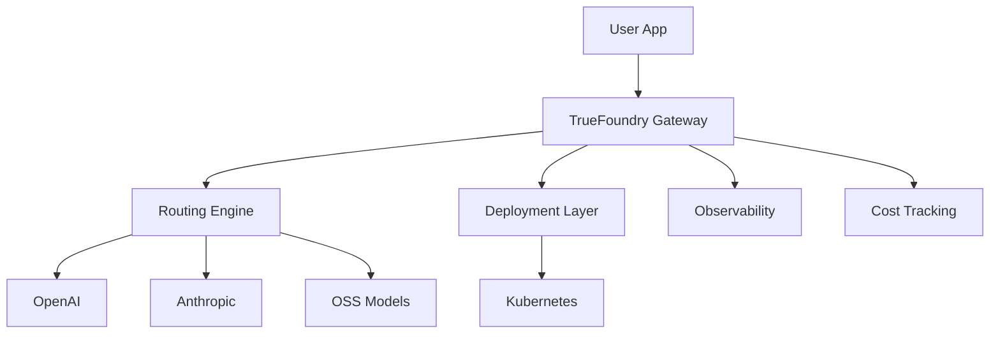
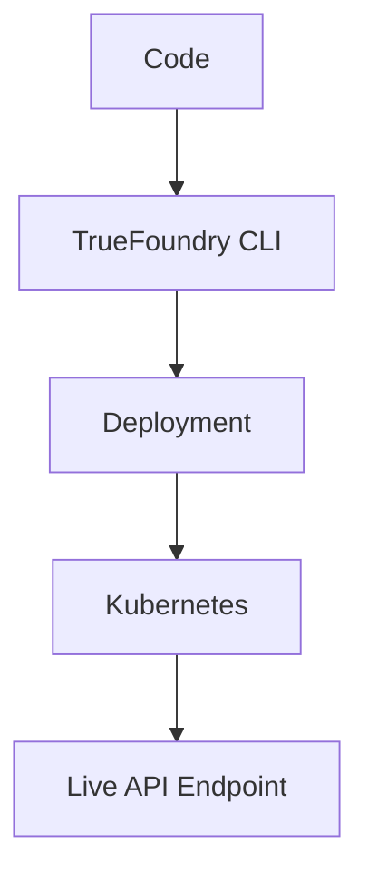
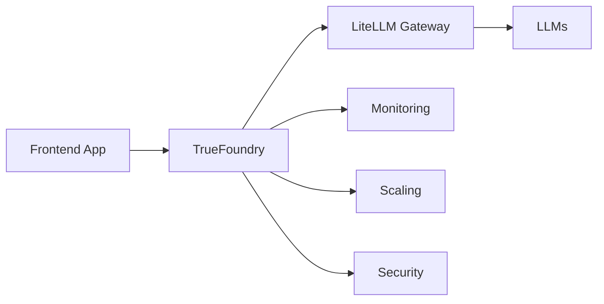

If LiteLLM is your **gateway layer**, then **TrueFoundry** is the **full production platform** that sits above it and manages the entire AI lifecycle.

👉 In simple terms:
**TrueFoundry = Platform to build, deploy, scale, and govern LLM/ML applications in production**

---

# 🚀 1. What is TrueFoundry?

**TrueFoundry** is an **enterprise AI platform** that helps teams:

* 🏗️ Build AI/LLM apps
* 🚀 Deploy them to production
* 📊 Monitor & scale them
* 🛡️ Govern usage securely

---

## 🎯 Core Idea

Instead of manually managing:

```text
Models + APIs + Infra + Scaling + Monitoring + Security
```

👉 TrueFoundry gives you:

```text
One platform to manage everything
```

---

## 🧠 Where It Fits in Stack

```mermaid
flowchart LR
    A[App] --> B[Gateway (LiteLLM)]
    B --> C[LLMs]

    A --> D[TrueFoundry Platform]
    D --> E[Deployment]
    D --> F[Scaling]
    D --> G[Monitoring]
```

---

# 🔑 2. Core Concepts

## 🧩 1. Model & App Deployment

Deploy:

* LLM apps
* APIs
* ML models

---

## ⚙️ 2. Autoscaling

* Scale based on traffic
* Handle spikes automatically

---

## 🧭 3. LLM Gateway (Built-in)

Similar to LiteLLM:

* Routing
* Fallbacks
* Cost tracking

---

## 👁️ 4. Observability

* Logs
* Metrics
* Traces

---

## 💰 5. Cost Tracking

* Track usage per team/user
* Optimize spend

---

## 🔐 6. Security & Governance

* API keys
* Access control (RBAC)
* Audit logs

---

## 🧪 7. Experimentation

* A/B testing models
* Evaluate performance

---

## 🔄 8. CI/CD for AI

* Version models
* Deploy updates safely

---

# 🏗️ TrueFoundry Architecture



---

# ⚙️ 3. How to Implement (Typical Workflow)

## 🧩 Step 1: Write Your LLM App

```python
from openai import OpenAI

client = OpenAI()

def app(request):
    response = client.chat.completions.create(
        model="gpt-4o",
        messages=[{"role": "user", "content": request["text"]}]
    )
    return {"response": response.choices[0].message.content}
```

---

## 🚀 Step 2: Deploy on TrueFoundry

Using CLI:

```bash
tfy deploy app.py
```

---

## ⚙️ Step 3: Configure Scaling

```yaml
replicas: 2
autoscaling:
  min: 1
  max: 10
```

---

## 🔐 Step 4: Add Access Control

```yaml
auth:
  type: api_key
```

---

## 📊 Step 5: Monitor

* Latency
* Errors
* Cost

---

# 🔁 Deployment Flow



---

# 💻 4. Example: LLM API Deployment

```python
# app.py
from fastapi import FastAPI
from openai import OpenAI

app = FastAPI()
client = OpenAI()

@app.post("/chat")
def chat(req: dict):
    response = client.chat.completions.create(
        model="gpt-4o",
        messages=[{"role": "user", "content": req["message"]}]
    )
    return {"response": response.choices[0].message.content}
```

Deploy:

```bash
tfy deploy app.py
```

---

# 🧪 5. Real-world Examples

## 🔹 Example 1: Chatbot Platform

* Uses multiple LLMs
* Routes via gateway
* Scales automatically

---

## 🔹 Example 2: RAG System

* Retriever + LLM
* Monitored via TrueFoundry
* Logs failures

---

## 🔹 Example 3: Enterprise AI API

* Secure endpoints
* API key access
* Usage tracking

---

# ⚖️ 6. Advantages

### 🚀 Faster Deployment

No infra setup needed

---

### 📈 Scalability

Handles production traffic

---

### 💰 Cost Visibility

Track and optimize usage

---

### 🔐 Enterprise Security

RBAC + audit logs

---

### 🧭 Built-in Gateway

No need to build routing manually

---

# ⚠️ 7. Requirements

### 🧠 Platform Understanding

You need to:

* Configure deployments
* Define scaling rules

---

### 💰 Cost

* Infra + platform cost

---

### ⚙️ Kubernetes Backend

* Runs on K8s (managed by platform)

---

### 🔐 Security Setup

* API keys
* Access policies

---

# 🔄 8. TrueFoundry vs LiteLLM

| Feature       | LiteLLM       | TrueFoundry   |
| ------------- | ------------- | ------------- |
| Type          | SDK + Gateway | Full Platform |
| Routing       | ✅             | ✅             |
| Deployment    | ❌             | ✅             |
| Scaling       | ❌             | ✅             |
| Observability | Basic         | Advanced      |
| Security      | Limited       | Enterprise    |

---

# 🔁 9. End-to-End AI Stack



---

# 🧾 Final Summary

### 🚀 TrueFoundry =

* 🏗️ Deployment platform
* 🧭 LLM gateway
* 📊 Observability system
* 💰 Cost tracker
* 🔐 Security layer
* ⚙️ Autoscaling engine

---

### 🧠 In One Line

👉 *TrueFoundry is the production control center for your LLM/ML applications*
